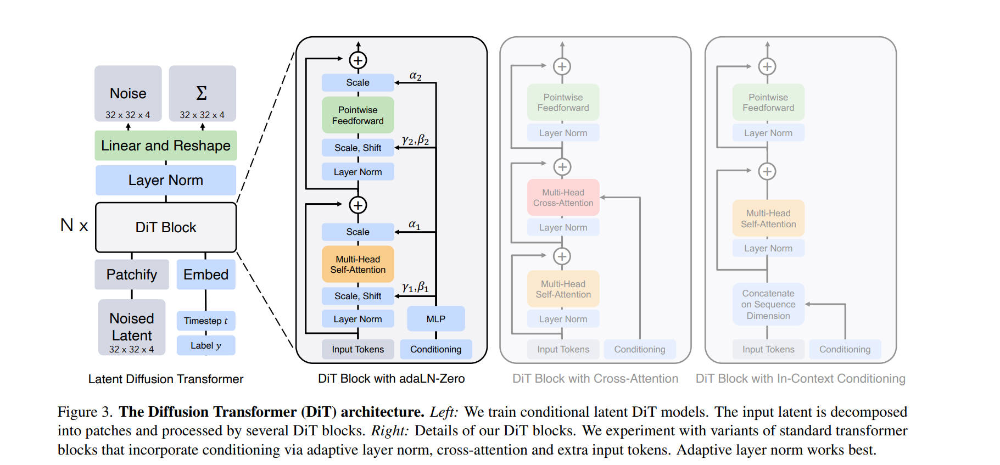

The proposal of [**DiT (Diffusion Transformer)**](https://arxiv.org/abs/2212.09748) marked a pivotal moment in generative AI, proving that Transformers could replace U-Net as the backbone for image generation.
While the training objectives have evolved—from the original **Diffusion** to modern **Flow Matching**—one component remains the "gold standard" for controlling generation: **adaLN-Zero**.

Here is how it works, and how modern video models like [SD3](https://arxiv.org/abs/2403.03206) and [Hunyuan Video](https://arxiv.org/abs/2412.03603) have evolved it.

## The Foundation: DiT and adaLN-Zero

In the original DiT paper, the focus was on standard **Denoising Diffusion (DDPM)**. 
Instead of concatenating conditions to the token sequence, DiT introduced **adaLN (Adaptive Layer Norm)** to "modulate" the image features based on the noise level.

**The Mechanism**: The model dynamically regresses dimension-wise scaling ($\gamma$), shifting ($\beta$), and gating ($\alpha$) parameters based on the input timestep $t$ and label $y$.

**The "Zero" Trick**: The critical innovation is **Zero-Initialization**. We initialize the final linear layer that predicts these parameters to zeros. 
This ensures that at the start of training, the residual branches output zero, making the entire DiT block behave as an Identity Function. This allows gradients to flow through the deep network unimpeded, significantly accelerating convergence.



**Core Implementation (PyTorch)**:

```python
class DiTBlock(nn.Module):
    def __init__(self, hidden_size):
        super().__init__()
        # Predict 6 parameters: (gamma1, beta1, alpha1, gamma2, beta2, alpha2)
        # These modulate the Attention and MLP sub-blocks respectively
        self.adaLN_modulation = nn.Sequential(
            nn.SiLU(),
            nn.Linear(hidden_size, 6 * hidden_size, bias=True)
        )
        
        # [CRITICAL] Zero Initialization
        # This ensures shift=0, scale=0, gate=0 at the start
        nn.init.constant_(self.adaLN_modulation[-1].weight, 0)
        nn.init.constant_(self.adaLN_modulation[-1].bias, 0)

    def forward(self, x, c):
        # c: global conditioning vector (timestep + label/text)
        
        # 1. Regress parameters (initially all zeros)
        shift_msa, scale_msa, gate_msa, ... = self.adaLN_modulation(c).chunk(6, dim=1)
        
        # 2. Modulate: Adjust distribution (Identity if scale=shift=0)
        x_norm = self.norm1(x) * (1 + scale_msa) + shift_msa
        
        # 3. Gate: Control residual flow (Block skipped if gate=0)
        x = x + gate_msa * self.attn(x_norm)
        return x
```

## The Evolution: Stable Diffusion 3 (MM-DiT)

Although SD3 adopts **Flow Matching (Rectified Flow)** as its training objective, its core architecture, **MM-DiT (Multimodal DiT)**, largely retains the foundational principles of the original DiT—most notably, the **adaLN-Zero** mechanism.

In this Dual-Stream architecture, **adaLN-Zero** continues to play a critical global role. The condition injected into it is a fusion of the **Timestep Embedding** and the **Pooled Text Embedding** (derived from the CLIP text encoder).

This allows the model to modulate both the Image and Text streams simultaneously using global style and flow information, before they interact via Joint Attention.


## The Scale-Up: Hunyuan Video (Visual-LLM)

Hunyuan Video adapts the DiT architecture for the massive scale of video generation. Like SD3, it utilizes **Flow Matching** as its objective, but it introduces a significant upgrade to the feature extraction process: **MLLM Integration**.

Instead of standard text encoders, Hunyuan uses a **Multimodal Large Language Model** to "see" and interpret the prompt. To ensure stability at this scale, it replaces the standard LayerNorm with **RMSNorm**.

Crucially, it retains the **adaLN-Zero** philosophy. The module now modulates the RMSNorm parameters, proving that the principle of zero-initialized identity mapping is robust enough to adapt to the different normalization standards used in modern LLM architectures.


