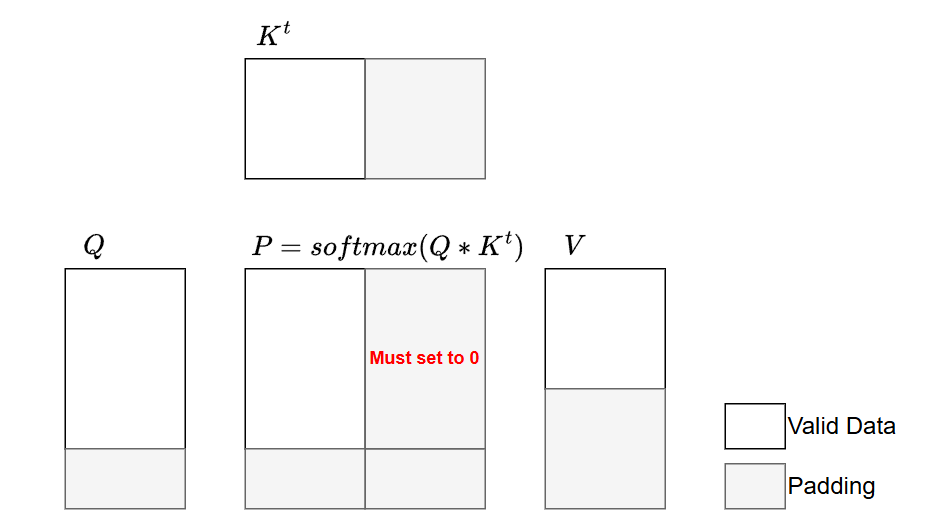
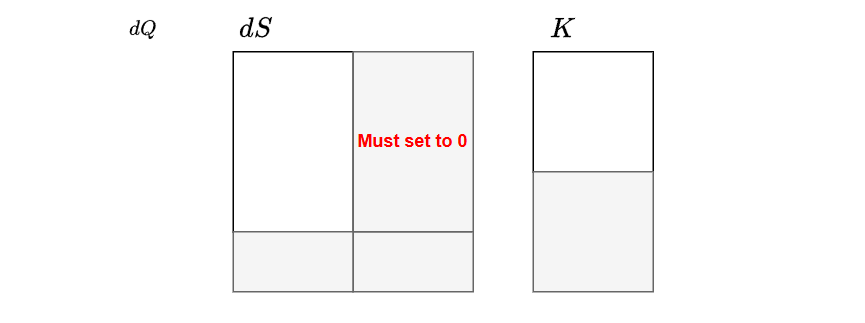
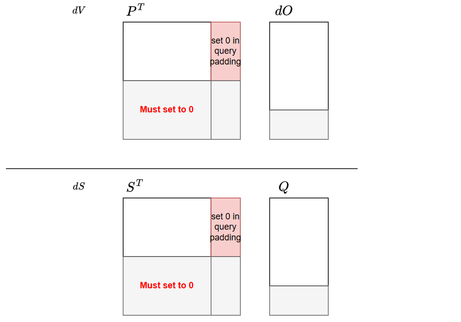

## Forward Pass

### Formulation & Online Softmax

Standard attention explicitly materializes the $N \times N$ score matrix $\mathbf{S}$ in High Bandwidth Memory (HBM). For long sequences, this not only results in quadratic memory consumption but also makes the operation heavily memory-bandwidth bound (due to excessive HBM read/write operations), significantly degrading execution speed:


$$
\begin{aligned}
    \mathbf{S} &= \frac{\mathbf{Q} \mathbf{K}^\top}{\sqrt{d}} \in \mathbb{R}^{N \times N} \\
    \mathbf{P} &= \text{softmax}(\mathbf{S}) \in \mathbb{R}^{N \times N} \\
    \mathbf{O} &= \mathbf{P} \mathbf{V} \in \mathbb{R}^{N \times d}
\end{aligned}
$$


To resolve both the memory footprint and the speed bottlenecks, memory-efficient attention (e.g., FlashAttention) utilizes the **online softmax trick**. By fusing the operations and processing them iteratively in fast SRAM blocks, it avoids the expensive HBM I/O bottleneck, achieving both a lower memory footprint and faster execution. When updating the running state with a new block of raw scores $\mathbf{S}^{(block)}$, the local maximum ($m$), the sum of exponentials ($l$), and the output accumulator ($\mathbf{O}$) are updated entirely in SRAM:

$$m^{(new)} = \max(m^{(old)}, \max(\mathbf{S}^{(block)}))$$

$$\alpha = e^{m^{(old)} - m^{(new)}}$$

$$l^{(new)} = l^{(old)} \alpha + \sum e^{\mathbf{S}^{(block)} - m^{(new)}}$$

$$\mathbf{O}^{(new)} = \mathbf{O}^{(old)} \alpha + e^{\mathbf{S}^{(block)} - m^{(new)}} \mathbf{V}^{(block)}$$

The final normalized output is $\mathbf{O} = \frac{\mathbf{O}^{(new)}}{l^{(new)}}$. For the backward pass, only the LogSumExp is persisted to HBM:

$$LSE = m^{(new)} + \log(l^{(new)}) = \log{\sum{e^{x_i}}}$$

### Base-2 Exponential

Modern GPU architectures compute base-2 exponentials (`exp2`) significantly faster than natural exponentials (exp). Using the algebraic identity $e^x = 2^{x \log_2(e)}$, the algorithm pre-scales the input score matrix by the constant $\log_2(e) \approx 1.442695$:

$$\mathbf{S}_{base2} = \mathbf{S} \cdot \log_2(e)$$

This transformation allows the kernel to replace all $e^x$ operations with $2^x$ without altering the mathematical outcome. The online update rules transition to base-2 logic:

$$\alpha = 2^{m^{(old)} - m^{(new)}}$$

$$l^{(new)} = l^{(old)} \alpha + \sum 2^{\mathbf{S}_{base2}^{(block)} - m^{(new)}}$$

$$\mathbf{O}^{(new)} = \mathbf{O}^{(old)} \alpha + 2^{\mathbf{S}_{base2}^{(block)} - m^{(new)}} \mathbf{V}^{(block)}$$

For the backward pass, the LogSumExp (LSE) saved to HBM utilizes the base-2 logarithm to maintain consistency with the forward pass values:

$$LSE = m^{(new)} + \log_2(l^{(new)}) = \log_2{\sum{e^{x_i}}}$$

### Out-of-Sequence Masking

When the sequence length $N$ is not perfectly divisible by the block size, trailing padding positions must be explicitly masked with $-\infty$ before computing the block maximum and exponentials.



If left unmasked (i.e., padded with $0$), the exponential operation evaluates to $2^0 = 1$, introducing severe numerical errors:

1. The normalizer $l^{(new)}$ is artificially inflated by $1$ for every invalid position.
2. The saved LSE is corrupted, leading to incorrect gradients during the backward pass.
3. The final output $\mathbf{O}$ is improperly down-scaled due to the enlarged denominator.

Masking with $-\infty$ ensures $2^{-\infty} = 0$, guaranteeing that padding contributes exactly zero to the sum of exponentials $l$ and the value accumulator $\mathbf{O}$.

### Triton Implementation (Forward)

```python
@triton.jit
def _fwd_kernel(
    q_ptr, k_ptr, v_ptr, o_ptr, lse_ptr, 
    sm_scale_log2, SEQ, 
    HEAD_NUM: tl.constexpr, HEAD_DIM: tl.constexpr, 
    BLOCK_M: tl.constexpr, BLOCK_N: tl.constexpr,
    DTYPE: tl.constexpr
):
    start_m = tl.program_id(0)
    off_head = tl.program_id(1)

    q_base = q_ptr + off_head * HEAD_DIM
    k_base = k_ptr + off_head * HEAD_DIM
    v_base = v_ptr + off_head * HEAD_DIM
    o_base = o_ptr + off_head * HEAD_DIM

    q_block_ptr = tl.make_block_ptr(
        base=q_base, shape=(SEQ, HEAD_DIM), strides=(HEAD_NUM * HEAD_DIM, 1),
        offsets=(start_m * BLOCK_M, 0), block_shape=(BLOCK_M, HEAD_DIM), order=(1, 0)
    )
    k_block_ptr = tl.make_block_ptr(
        base=k_base, shape=(SEQ, HEAD_DIM), strides=(HEAD_NUM * HEAD_DIM, 1),
        offsets=(0, 0), block_shape=(BLOCK_N, HEAD_DIM), order=(1, 0)
    )
    v_block_ptr = tl.make_block_ptr(
        base=v_base, shape=(SEQ, HEAD_DIM), strides=(HEAD_NUM * HEAD_DIM, 1),
        offsets=(0, 0), block_shape=(BLOCK_N, HEAD_DIM), order=(1, 0)
    )

    m_i = tl.zeros([BLOCK_M], dtype=tl.float32) - float("inf")
    l_i = tl.zeros([BLOCK_M], dtype=tl.float32)
    acc = tl.zeros([BLOCK_M, HEAD_DIM], dtype=tl.float32)

    q = tl.load(q_block_ptr, boundary_check=(0, 1))

    for start_n in range(0, SEQ, BLOCK_N):
        k = tl.load(k_block_ptr, boundary_check=(0, 1))
        v = tl.load(v_block_ptr, boundary_check=(0, 1))

        qk = tl.dot(q, tl.trans(k)) * sm_scale_log2
        # it's necessary to mask scores for out-of-sequence positions to -inf before computing max for correctness
        if start_n + BLOCK_N >= SEQ:
            mask_n = start_n + tl.arange(0, BLOCK_N) < SEQ
            qk = tl.where(mask_n[None, :], qk, float("-inf"))
        m_ij = tl.maximum(m_i, tl.max(qk, 1))
        p = tl.math.exp2(qk - m_ij[:, None]) 
        alpha = tl.math.exp2(m_i - m_ij)

        l_i = l_i * alpha + tl.sum(p, 1)
        acc = acc * alpha[:, None] + tl.dot(p.to(v.dtype), v)
        m_i = m_ij

        k_block_ptr = tl.advance(k_block_ptr, (BLOCK_N, 0))
        v_block_ptr = tl.advance(v_block_ptr, (BLOCK_N, 0))

    acc = acc / l_i[:, None]
    acc = acc.to(DTYPE)

    lse_base = lse_ptr + off_head * SEQ
    offs_m = start_m * BLOCK_M + tl.arange(0, BLOCK_M)
    tl.store(lse_base + offs_m, m_i + tl.math.log2(l_i), mask=offs_m < SEQ)

    o_block_ptr = tl.make_block_ptr(
        base=o_base, shape=(SEQ, HEAD_DIM), strides=(HEAD_NUM * HEAD_DIM, 1),
        offsets=(start_m * BLOCK_M, 0), block_shape=(BLOCK_M, HEAD_DIM), order=(1, 0)
    )
    tl.store(o_block_ptr, acc, boundary_check=(0, 1))
```

## Backward Pass

### Formulation


$$
\begin{aligned}
  \mathbf{dV} &= \mathbf{P}^\top \mathbf{dO} \in \mathbb{R}^{N \times d} \\
  \mathbf{dP} &= \mathbf{dO} \mathbf{V}^\top \in \mathbb{R}^{N \times N} \\
  \mathbf{dS} &= \mathbf{dsoftmax (\mathbf{dP})} \in \mathbb{R}^{N \times N} \\
  &= \mathbf{P} \odot (\mathbf{dP} - \text{row\_sum}( \mathbf{dP} \odot \mathbf{P}))\\
  \mathbf{dQ} &= \frac{\mathbf{dS} \mathbf{K}}{\sqrt{d}} \in \mathbb{R}^{N \times d} \\
  \mathbf{dK} &= \frac{\mathbf{dS}^\top \mathbf{Q}}{\sqrt{d}} \in \mathbb{R}^{N \times d},
\end{aligned}
$$



### The $O(N)$ Preprocessing Trick

To compute $\mathbf{dS}$, the row-wise sum of $\mathbf{dP} \odot \mathbf{P}$ appears to require $O(N^2)$ memory to materialize the full matrices. However, it can be mathematically reduced to an $O(N \times d)$ operation by factoring it into a dot product of the output $\mathbf{O}$ and the output gradient $\mathbf{dO}$:


$$
\begin{aligned}
\mathbf{D}_{i} &= \sum_j \mathbf{dP}_{ij} \mathbf{P}_{ij} \\
&= \sum_j \left(\sum_k \mathbf{dO}_{ik} \mathbf{V}^\top_{kj}\right) \mathbf{P}_{ij} \\
&= \sum_k \mathbf{dO}_{ik} \sum_j (\mathbf{V}^\top_{kj} \mathbf{P}_{ij}) \\
&= \sum_k \mathbf{dO}_{ik} \sum_j (\mathbf{P}_{ij} \mathbf{V}_{jk}) \\
&= \sum_k \mathbf{dO}_{ik} \mathbf{O}_{ik}
\end{aligned}
$$


The precomputed vector $\mathbf{D} \in \mathbb{R}^N$ (passed as the `delta` parameter in the Triton implementation) is calculated before launching the backward kernels, preventing redundant element-wise reductions inside the tight inner loops.

### `dQ` Computation

To compute $\mathbf{dQ}$, the kernel keeps a block of $\mathbf{Q}$ and $\mathbf{dO}$ resident in SRAM while iterating over blocks of $\mathbf{K}$ and $\mathbf{V}$. The attention probabilities $\mathbf{P}$ and intermediate gradient $\mathbf{dS}$ are dynamically recomputed using the $LSE$ saved during the forward pass, allowing $\mathbf{dQ}$ to be accumulated entirely in SRAM.



### The `NaN` Hazard for Masked Positions
Explicitly masking padded positions of $\mathbf{Q}\mathbf{K}^\top$ to $-\infty$ is mandatory during recomputation. Without it, padded $\mathbf{K}$ vectors (which are zeroed out) produce a dot product of $0$. If a valid query has a large negative $LSE$ (e.g., $-20$), the unmasked exponent evaluates to $2^{0 - (-20)} = 2^{20}$. This overflows float16 limits, yielding Inf. The subsequent calculation multiplies this by padded zeros ($\text{Inf} \times 0$), resulting in NaN and destroying the gradient tensor. Masking ensures the exponent evaluates safely to $2^{-\infty} = 0$.

### `dKdV` Computation

To compute $\mathbf{dK}$ and $\mathbf{dV}$, the computation loop is inverted. The kernel assigns a block of $\mathbf{K}$ and $\mathbf{V}$ to SRAM and iterates over the sequence dimension to fetch blocks of $\mathbf{Q}$ and $\mathbf{dO}$. Using the exact same recomputation logic and masking rules, $\mathbf{dV}$ and $\mathbf{dK}$ are accumulated directly into SRAM and written to HBM once complete.

### Implicit Masking in the Q Dimension

In the `_bwd_dk_dv_kernel`, explicit `-inf` masking is only applied to the KV sequence dimension ($n$). For the Q sequence dimension ($m$), **the kernel relies on implicit zero-padding rather than explicit masking**.

When the Q block indices exceed the actual sequence length, Triton's `boundary_check=(0, 1)` automatically pads the out-of-bounds elements of $\mathbf{Q}$ and $\mathbf{dO}$ with zeros. Similarly, $\mathbf{LSE}$ and $\Delta$ are zero-padded via the `mask=offs_m < SEQ` argument in `tl.load`.

This zero-padding propagates safely through the gradient computation. Specifically, $\mathbf{Q}\mathbf{K}^T$ evaluates to $0$, resulting in $P = 2^{0 - 0} = 1$. Although a non-zero $P$ at padding positions seems mathematically incorrect, it does not corrupt the output gradients because $\mathbf{dO}$ is an all-zero matrix in this region:
* **For $\mathbf{dV}$**: The matrix multiplication $\mathbf{dV} += P^T \mathbf{dO}$ evaluates to $0$.
* **For $\mathbf{dK}$**: The intermediate variable $dP = \mathbf{dO}\mathbf{V}^T = 0$, and $\Delta = 0$. This leads to $dS = P \cdot (dP - \Delta) \cdot \text{scale} = 0$. Consequently, the matrix multiplication $\mathbf{dK} += dS^T \mathbf{Q}$ also evaluates to $0$.

This implicit masking strategy avoids redundant bound checks and `-inf` assignments in the inner $m$-loop, improving overall kernel performance. However, the correctness of this optimization strictly depends on the assumption that out-of-bounds elements in $\mathbf{dO}$ and $\mathbf{Q}$ are **safely zero-padded during memory loads**.

### Explicit Masking Requirement for Non-Zero Padding

**The reliance on implicit zero-padding fails if the input tensors are not strictly zeroed out in the padded regions**. In architectures requiring manual sequence padding before the attention kernel—such as Variable Sparse Attention (VSA)—padding tokens might contain non-zero values or residual data. If $\mathbf{Q}$ or $\mathbf{dO}$ contains non-zero values in out-of-bounds regions, the mathematical cancellation fails. The non-zero $\mathbf{dO}$ will interact with the intermediate $P$ matrix (which evaluates to $1$ when $\mathbf{Q}\mathbf{K}^T=0$ and $\mathbf{LSE}=0$), leading to erroneous gradient accumulations in $\mathbf{dK}$ and $\mathbf{dV}$. Under these conditions, explicit masking for the query dimension ($m$) is strictly required.

Crucially, this mask must be applied by directly zeroing out $P$, rather than setting $\mathbf{Q}\mathbf{K}^T$ to $-\infty$. Because the $\mathbf{LSE}$ values at out-of-bounds positions are undefined (and frequently recorded as $-\infty$ during the forward pass), masking $\mathbf{Q}\mathbf{K}^T$ to $-\infty$ can trigger a $-\infty - (-\infty)$ operation when calculating $\mathbf{Q}\mathbf{K}^T - \mathbf{LSE}$. This yields `NaN` and corrupts the entire gradient matrix. Explicitly forcing $P$ to $0.0$ after the exponential evaluation completely bypasses this numerical instability and safely halts gradient propagation to out-of-bounds indices.



### Triton Implementation (Backward)


* `dq`
```python
@triton.jit
def _bwd_dq_kernel(
    q_ptr, k_ptr, v_ptr, do_ptr, dq_ptr, lse_ptr, delta_ptr,
    sm_scale, sm_scale_log2e, SEQ, 
    HEAD_NUM: tl.constexpr, HEAD_DIM: tl.constexpr, 
    BLOCK_M: tl.constexpr, BLOCK_N: tl.constexpr,
    DTYPE: tl.constexpr
):
    start_m = tl.program_id(0)
    off_h = tl.program_id(1)

    stride_seq = HEAD_NUM * HEAD_DIM
    q_base = q_ptr + off_h * HEAD_DIM
    k_base = k_ptr + off_h * HEAD_DIM
    v_base = v_ptr + off_h * HEAD_DIM
    do_base = do_ptr + off_h * HEAD_DIM
    dq_base = dq_ptr + off_h * HEAD_DIM 

    q_block_ptr = tl.make_block_ptr(
        base=q_base, shape=(SEQ, HEAD_DIM), 
        strides=(stride_seq, 1), offsets=(start_m * BLOCK_M, 0), 
        block_shape=(BLOCK_M, HEAD_DIM), order=(1, 0)
    )
    do_block_ptr = tl.make_block_ptr(
        base=do_base, shape=(SEQ, HEAD_DIM), 
        strides=(stride_seq, 1), offsets=(start_m * BLOCK_M, 0), 
        block_shape=(BLOCK_M, HEAD_DIM), order=(1, 0)
    )

    k_block_ptr = tl.make_block_ptr(
        base=k_base, shape=(SEQ, HEAD_DIM), 
        strides=(stride_seq, 1), offsets=(0, 0), 
        block_shape=(BLOCK_N, HEAD_DIM), order=(1, 0)
    )
    v_block_ptr = tl.make_block_ptr(
        base=v_base, shape=(SEQ, HEAD_DIM), 
        strides=(stride_seq, 1), offsets=(0, 0), 
        block_shape=(BLOCK_N, HEAD_DIM), order=(1, 0)
    )

    q = tl.load(q_block_ptr, boundary_check=(0, 1))
    do = tl.load(do_block_ptr, boundary_check=(0, 1))

    offs_m = start_m * BLOCK_M + tl.arange(0, BLOCK_M)
    lse = tl.load(lse_ptr + off_h * SEQ + offs_m, mask=offs_m < SEQ)
    delta = tl.load(delta_ptr + off_h * SEQ + offs_m, mask=offs_m < SEQ)

    dq = tl.zeros([BLOCK_M, HEAD_DIM], dtype=tl.float32)

    for start_n in range(0, SEQ, BLOCK_N):
        k = tl.load(k_block_ptr, boundary_check=(0, 1))
        v = tl.load(v_block_ptr, boundary_check=(0, 1))

        # recompute qk
        qk = tl.dot(q, tl.trans(k)) * sm_scale_log2e
        # althought the lse is right in forward, but inf * 0 maybe NaN in backward, so we still need to mask qk for out-of-sequence positions to -inf to ensure p is 0 at those positions
        if start_n + BLOCK_N >= SEQ:
            mask_n = start_n + tl.arange(0, BLOCK_N) < SEQ
            qk = tl.where(mask_n[None, :], qk, float("-inf"))
        
        p = tl.math.exp2(qk - lse[:, None])

        dp = tl.dot(do, tl.trans(v))
        ds = p * (dp - delta[:, None]) * sm_scale
        dq = tl.dot(ds.to(k.dtype), k, dq)

        k_block_ptr = tl.advance(k_block_ptr, (BLOCK_N, 0))
        v_block_ptr = tl.advance(v_block_ptr, (BLOCK_N, 0))

    dq_block_ptr = tl.make_block_ptr(
        base=dq_base, shape=(SEQ, HEAD_DIM), 
        strides=(stride_seq, 1), offsets=(start_m * BLOCK_M, 0), 
        block_shape=(BLOCK_M, HEAD_DIM), order=(1, 0)
    )
    tl.store(dq_block_ptr, dq.to(DTYPE), boundary_check=(0, 1))
```

* `dk dv`
```python
@triton.jit
def _bwd_dk_dv_kernel(
    q_ptr, k_ptr, v_ptr, do_ptr, dk_ptr, dv_ptr, lse_ptr, delta_ptr, 
    sm_scale, sm_scale_log2e, SEQ, 
    HEAD_NUM: tl.constexpr, HEAD_DIM: tl.constexpr, 
    BLOCK_M: tl.constexpr, BLOCK_N: tl.constexpr,
    DTYPE: tl.constexpr
):
    start_n = tl.program_id(0)
    off_h = tl.program_id(1)

    stride_seq = HEAD_NUM * HEAD_DIM
    q_base = q_ptr + off_h * HEAD_DIM
    k_base = k_ptr + off_h * HEAD_DIM
    v_base = v_ptr + off_h * HEAD_DIM
    do_base = do_ptr + off_h * HEAD_DIM
    dk_base = dk_ptr + off_h * HEAD_DIM
    dv_base = dv_ptr + off_h * HEAD_DIM

    k_block_ptr = tl.make_block_ptr(
        base=k_base, shape=(SEQ, HEAD_DIM), 
        strides=(stride_seq, 1), offsets=(start_n * BLOCK_N, 0), 
        block_shape=(BLOCK_N, HEAD_DIM), order=(1, 0)
    )
    v_block_ptr = tl.make_block_ptr(
        base=v_base, shape=(SEQ, HEAD_DIM), 
        strides=(stride_seq, 1), offsets=(start_n * BLOCK_N, 0), 
        block_shape=(BLOCK_N, HEAD_DIM), order=(1, 0)
    )

    q_block_ptr = tl.make_block_ptr(
        base=q_base, shape=(SEQ, HEAD_DIM), 
        strides=(stride_seq, 1), offsets=(0, 0), 
        block_shape=(BLOCK_M, HEAD_DIM), order=(1, 0)
    )
    do_block_ptr = tl.make_block_ptr(
        base=do_base, shape=(SEQ, HEAD_DIM), 
        strides=(stride_seq, 1), offsets=(0, 0), 
        block_shape=(BLOCK_M, HEAD_DIM), order=(1, 0)
    )

    k = tl.load(k_block_ptr, boundary_check=(0, 1))
    v = tl.load(v_block_ptr, boundary_check=(0, 1))

    dk = tl.zeros([BLOCK_N, HEAD_DIM], dtype=tl.float32)
    dv = tl.zeros([BLOCK_N, HEAD_DIM], dtype=tl.float32)
    
    offs_n = start_n * BLOCK_N + tl.arange(0, BLOCK_N)

    for start_m_idx in range(0, SEQ, BLOCK_M):
        offs_m = start_m_idx + tl.arange(0, BLOCK_M)
        
        q = tl.load(q_block_ptr, boundary_check=(0, 1))
        do = tl.load(do_block_ptr, boundary_check=(0, 1))
        
        lse = tl.load(lse_ptr + off_h * SEQ + offs_m, mask=offs_m < SEQ)
        delta = tl.load(delta_ptr + off_h * SEQ + offs_m, mask=offs_m < SEQ)

        qk = tl.dot(q, tl.trans(k)) * sm_scale_log2e

        if start_n + BLOCK_N >= SEQ:
            mask_n = start_n + tl.arange(0, BLOCK_N) < SEQ
            qk = tl.where(mask_n[None, :], qk, float("-inf"))

        p = tl.math.exp2(qk - lse[:, None])

        # If the input at padding positions cannot be guaranteed to be strictly 0,
        # we must explicitly mask `p` to 0.0 along the m dimension (Query dimension).
        # Note: Because the `lse` values at out-of-bounds positions are uncertain
        # (they might be recorded as -inf during the forward pass), setting `qk` to -inf 
        # could result in evaluating exp2(-inf - (-inf)), which yields NaN. 
        # This fails to guarantee that `p` evaluates to 0. 
        # Therefore, the zero-masking must be applied directly to `p` after its computation.
        if start_m_idx + BLOCK_M >= SEQ:
            mask_m = offs_m < SEQ
            p = tl.where(mask_m[:, None], p, 0.0)

        dv = tl.dot(tl.trans(p).to(do.dtype), do, dv)

        dp = tl.dot(do, tl.trans(v))
        ds = p * (dp - delta[:, None]) * sm_scale
        dk = tl.dot(tl.trans(ds).to(q.dtype), q, dk)

        q_block_ptr = tl.advance(q_block_ptr, (BLOCK_M, 0))
        do_block_ptr = tl.advance(do_block_ptr, (BLOCK_M, 0))

    dk_block_ptr = tl.make_block_ptr(
        base=dk_base, shape=(SEQ, HEAD_DIM), 
        strides=(stride_seq, 1), offsets=(start_n * BLOCK_N, 0), 
        block_shape=(BLOCK_N, HEAD_DIM), order=(1, 0)
    )
    tl.store(dk_block_ptr, dk.to(DTYPE), boundary_check=(0, 1))
    dv_block_ptr = tl.make_block_ptr(
        base=dv_base, shape=(SEQ, HEAD_DIM), 
        strides=(stride_seq, 1), offsets=(start_n * BLOCK_N, 0), 
        block_shape=(BLOCK_N, HEAD_DIM), order=(1, 0)
    )
    tl.store(dv_block_ptr, dv.to(DTYPE), boundary_check=(0, 1))
```

## Architecture Design: Triton vs. CUDA

The backward pass implementation differs fundamentally between the official CUDA release and this Triton version, primarily due to the performance penalty of global memory atomics.
* **CUDA (Single Kernel, $10 N^2 d$ FLOPS)**: Uses an outer loop over $\mathbf{K}/\mathbf{V}$ and an inner loop over $\mathbf{Q}/\mathbf{dO}$. It accumulates $\mathbf{dK}$ and $\mathbf{dV}$ purely in SRAM, but requires hardware atomicAdd to update $\mathbf{dQ}$ in HBM due to concurrent thread block writes. It is computationally optimal, recomputing $\mathbf{Q}\mathbf{K}^\top$ only once ($10 N^2 d$ FLOPS).
* **Triton (Two Kernels, $12 N^2 d$ FLOPS)**: While Triton supports `tl.atomic_add`, managing massive concurrent atomic writes to HBM across thread blocks often leads to severe L2 cache thrashing and serialization overhead. To avoid atomic reductions and memory contention, Triton splits the backward pass into two non-overlapping kernels (`_bwd_dq_kernel` and `_bwd_dk_dv_kernel`), allowing all gradients to accumulate exclusively in SRAM. The tradeoff is computational redundancy: $\mathbf{Q}\mathbf{K}^\top$ and $\mathbf{P}$ are recomputed twice, increasing the total workload to $12 N^2 d$ FLOPS, trading extra compute for memory safety and bandwidth efficiency.