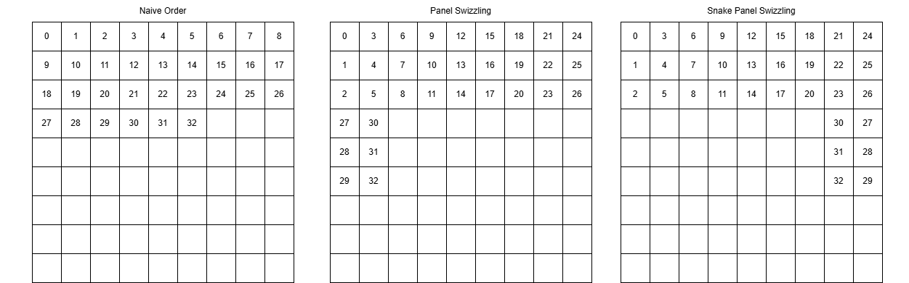

GEMM is a fundamental kernel in CUDA. This blog presents a 4-step progression to accelerate GEMM in Triton, starting from a naive implementation to advanced hardware-specific features.

Note: While this tutorial references the foundational code from the official [Triton Toturial 03 Matrix Multiplication](https://triton-lang.org/main/getting-started/tutorials/03-matrix-multiplication.html) (specifically Step 0, Step 1, and the basic L2 cache optimization), it significantly expands upon it. The L2 Cache section introduces advanced snake and dynamic ordering methods, and the final step covering Hopper TMA (Tensor Memory Accelerator) is an entirely original addition not found in the official guide.

## Step 0: Naive Tiling in GEMM

To compute the matrix multiplication $C = A \times B$ where $A$ is $(M, K)$ and $B$ is $(K, N)$, we cannot load the entire matrices into SRAM. Instead, we divide the output matrix $C$ into tiles (blocks) of size BLOCK_SIZE_M $\times$ BLOCK_SIZE_N.

Each Triton program (instance) computes one block of $C$ by iterating over the $K$ dimension in steps of BLOCK_SIZE_K, loading the corresponding blocks of $A$ and $B$, computing the dot product, and accumulating the results.

### Kernel Implementation
```python
import triton
import triton.language as tl
import torch

@triton.jit
def leaky_relu(x):
    return tl.where(x >= 0, x, 0.01 * x)

@triton.jit
def matmul_kernel(
        a_ptr, b_ptr, c_ptr,
        M, N, K,
        stride_am, stride_ak,
        stride_bk, stride_bn,
        stride_cm, stride_cn,
        BLOCK_SIZE_M: tl.constexpr, BLOCK_SIZE_N: tl.constexpr, BLOCK_SIZE_K: tl.constexpr,
        ACTIVATION: tl.constexpr,
):
    pid = tl.program_id(axis=0)
    num_pid_m = tl.cdiv(M, BLOCK_SIZE_M)
    num_pid_n = tl.cdiv(N, BLOCK_SIZE_N)
    pid_m = pid // num_pid_n
    pid_n = pid % num_pid_n

    offs_am = (pid_m * BLOCK_SIZE_M + tl.arange(0, BLOCK_SIZE_M)) % M
    offs_bn = (pid_n * BLOCK_SIZE_N + tl.arange(0, BLOCK_SIZE_N)) % N
    offs_k = tl.arange(0, BLOCK_SIZE_K)
    a_ptrs = a_ptr + (offs_am[:, None] * stride_am + offs_k[None, :] * stride_ak)
    b_ptrs = b_ptr + (offs_k[:, None] * stride_bk + offs_bn[None, :] * stride_bn)

    accumulator = tl.zeros((BLOCK_SIZE_M, BLOCK_SIZE_N), dtype=tl.float32)
    for k in range(0, tl.cdiv(K, BLOCK_SIZE_K)):
        a = tl.load(a_ptrs, mask=offs_k[None, :] < K - k * BLOCK_SIZE_K, other=0.0)
        b = tl.load(b_ptrs, mask=offs_k[:, None] < K - k * BLOCK_SIZE_K, other=0.0)
        accumulator = tl.dot(a, b, accumulator)
        a_ptrs += BLOCK_SIZE_K * stride_ak
        b_ptrs += BLOCK_SIZE_K * stride_bk

    if ACTIVATION == "leaky_relu":
        accumulator = leaky_relu(accumulator)
    c = accumulator.to(tl.float16)

    offs_cm = pid_m * BLOCK_SIZE_M + tl.arange(0, BLOCK_SIZE_M)
    offs_cn = pid_n * BLOCK_SIZE_N + tl.arange(0, BLOCK_SIZE_N)
    c_ptrs = c_ptr + stride_cm * offs_cm[:, None] + stride_cn * offs_cn[None, :]
    c_mask = (offs_cm[:, None] < M) & (offs_cn[None, :] < N)
    tl.store(c_ptrs, c, mask=c_mask)
```

### Launcher Function
In this naive version, the block sizes are hardcoded. We use a 1D grid where each program ID (pid) handles one block of the output matrix.
```python
def matmul(a, b, activation=""):
    # Check constraints.
    assert a.shape[1] == b.shape[0], "Incompatible dimensions"
    assert a.is_contiguous(), "Matrix A must be contiguous"
    M, K = a.shape
    K, N = b.shape
    c = torch.empty((M, N), device=a.device, dtype=a.dtype)
    
    # Hardcoded hyper-parameters
    BLOCK_SIZE_M = 128
    BLOCK_SIZE_N = 128
    BLOCK_SIZE_K = 32
    grid = (triton.cdiv(M, BLOCK_SIZE_M) * triton.cdiv(N, BLOCK_SIZE_N), )
    matmul_kernel[grid](
        a, b, c,  #
        M, N, K,  #
        a.stride(0), a.stride(1),  #
        b.stride(0), b.stride(1),  #
        c.stride(0), c.stride(1),  #
        BLOCK_SIZE_M=BLOCK_SIZE_M, BLOCK_SIZE_N=BLOCK_SIZE_N, BLOCK_SIZE_K=BLOCK_SIZE_K,  #
        ACTIVATION=activation  #
    )
    return c
```

## Step 1: Autotuning

Hardcoded block sizes are inherently suboptimal. GPU architecture characteristics (e.g., SRAM capacity, number of SMs) and specific matrix dimensions require dynamic tuning of execution parameters to maximize throughput.

The key parameters to tune are:
* Tiling Dimensions: `BLOCK_SIZE_M`, `BLOCK_SIZE_N`, `BLOCK_SIZE_K`
* Execution Configs: `num_warps` (number of warps allocated per thread block) and `num_stages` (depth of the software pipeline used to hide global memory latency).

Triton provides the `@triton.autotune` decorator. During the first execution of the kernel, it compiles and benchmarks the defined search space, caching the optimal configuration for subsequent calls.

### Defining the Search Space

We define a list of `triton.Config` objects representing our search space. We apply the decorator to our kernel and specify `key=['M', 'N', 'K']` so that the autotuner re-evaluates the optimal config if the input matrix dimensions change.
> 💡 Production Tip for LLM Training (`thd` format) In real-world scenarios like LLM training with the `thd` format (e.g., packed sequences or variable sequence lengths), the `M` dimension changes on almost every iteration, while `N` and `K` (typically hidden sizes) remain constant.
> If you strictly use `key=['M', 'N', 'K']`, Triton will trigger a costly autotuning sweep and kernel recompilation for every unique `M` it encounters, severely degrading training throughput. To avoid this massive overhead, production code usually "buckets" `M` to the nearest power of 2 (or a multiple of 128/256).

```python
def get_autotune_config():
    return [
        triton.Config({'BLOCK_SIZE_M': 128, 'BLOCK_SIZE_N': 256, 'BLOCK_SIZE_K': 64, 'GROUP_SIZE_M': 8}, num_stages=3,
                      num_warps=8),
        triton.Config({'BLOCK_SIZE_M': 64, 'BLOCK_SIZE_N': 256, 'BLOCK_SIZE_K': 32, 'GROUP_SIZE_M': 8}, num_stages=4,
                      num_warps=4),
        triton.Config({'BLOCK_SIZE_M': 128, 'BLOCK_SIZE_N': 128, 'BLOCK_SIZE_K': 32, 'GROUP_SIZE_M': 8}, num_stages=4,
                      num_warps=4),
        triton.Config({'BLOCK_SIZE_M': 128, 'BLOCK_SIZE_N': 64, 'BLOCK_SIZE_K': 32, 'GROUP_SIZE_M': 8}, num_stages=4,
                      num_warps=4),
        triton.Config({'BLOCK_SIZE_M': 64, 'BLOCK_SIZE_N': 128, 'BLOCK_SIZE_K': 32, 'GROUP_SIZE_M': 8}, num_stages=4,
                      num_warps=4),
        triton.Config({'BLOCK_SIZE_M': 128, 'BLOCK_SIZE_N': 32, 'BLOCK_SIZE_K': 32, 'GROUP_SIZE_M': 8}, num_stages=4,
                      num_warps=4),
        triton.Config({'BLOCK_SIZE_M': 64, 'BLOCK_SIZE_N': 32, 'BLOCK_SIZE_K': 32, 'GROUP_SIZE_M': 8}, num_stages=5,
                      num_warps=2),
        triton.Config({'BLOCK_SIZE_M': 32, 'BLOCK_SIZE_N': 64, 'BLOCK_SIZE_K': 32, 'GROUP_SIZE_M': 8}, num_stages=5,
                      num_warps=2),
        # Good config for fp8 inputs.
        triton.Config({'BLOCK_SIZE_M': 128, 'BLOCK_SIZE_N': 256, 'BLOCK_SIZE_K': 128, 'GROUP_SIZE_M': 8}, num_stages=3,
                      num_warps=8),
        triton.Config({'BLOCK_SIZE_M': 256, 'BLOCK_SIZE_N': 128, 'BLOCK_SIZE_K': 128, 'GROUP_SIZE_M': 8}, num_stages=3,
                      num_warps=8),
        triton.Config({'BLOCK_SIZE_M': 256, 'BLOCK_SIZE_N': 64, 'BLOCK_SIZE_K': 128, 'GROUP_SIZE_M': 8}, num_stages=4,
                      num_warps=4),
        triton.Config({'BLOCK_SIZE_M': 64, 'BLOCK_SIZE_N': 256, 'BLOCK_SIZE_K': 128, 'GROUP_SIZE_M': 8}, num_stages=4,
                      num_warps=4),
        triton.Config({'BLOCK_SIZE_M': 128, 'BLOCK_SIZE_N': 128, 'BLOCK_SIZE_K': 128, 'GROUP_SIZE_M': 8}, num_stages=4,
                      num_warps=4),
        triton.Config({'BLOCK_SIZE_M': 128, 'BLOCK_SIZE_N': 64, 'BLOCK_SIZE_K': 64, 'GROUP_SIZE_M': 8}, num_stages=4,
                      num_warps=4),
        triton.Config({'BLOCK_SIZE_M': 64, 'BLOCK_SIZE_N': 128, 'BLOCK_SIZE_K': 64, 'GROUP_SIZE_M': 8}, num_stages=4,
                      num_warps=4),
        triton.Config({'BLOCK_SIZE_M': 128, 'BLOCK_SIZE_N': 32, 'BLOCK_SIZE_K': 64, 'GROUP_SIZE_M': 8}, num_stages=4,
                      num_warps=4)
    ]

@triton.autotune(
    configs=get_autotune_config(),
    key=['M', 'N', 'K'],
)
@triton.jit
def matmul_kernel(
        a_ptr, b_ptr, c_ptr,
        M, N, K,
        stride_am, stride_ak,
        stride_bk, stride_bn,
        stride_cm, stride_cn,
        BLOCK_SIZE_M: tl.constexpr, BLOCK_SIZE_N: tl.constexpr, BLOCK_SIZE_K: tl.constexpr,
        ACTIVATION: tl.constexpr,
):
    # ... (Kernel compute logic remains identical to step0) ...
```

### Updating the Launcher

Since the autotuner now manages the `BLOCK_SIZE` parameters, we remove them from the explicit kernel call. The grid calculation must be updated to use a `lambda` function, which extracts the runtime-injected `META` configuration.

```python
def matmul(a, b, activation=""):
    assert a.shape[1] == b.shape[0], "Incompatible dimensions"
    assert a.is_contiguous(), "Matrix A must be contiguous"
    M, K = a.shape
    K, N = b.shape
    c = torch.empty((M, N), device=a.device, dtype=a.dtype)
    
    # Grid now accepts a META parameter containing the selected config
    grid = lambda META: (
        triton.cdiv(M, META['BLOCK_SIZE_M']) * triton.cdiv(N, META['BLOCK_SIZE_N']), 
    )
    
    matmul_kernel_v1[grid](
        a, b, c,
        M, N, K,
        a.stride(0), a.stride(1),
        b.stride(0), b.stride(1),
        c.stride(0), c.stride(1),
        ACTIVATION=activation
    )
    return c
```

## Step 2: L2 Cache Optimizations

This section introduces standard panel swizzling and snake panel swizzling. Panel swizzling significantly improves the L2 cache hit rate by optimizing the scheduling order of thread blocks.

This optimization only modifies the mapping logic of the program IDs (`pid_m` and `pid_n`).



### Panel Swizzling (Grouped Ordering)

By default, thread blocks are launched in a linear, row-major order. The GPU computes the first row of blocks across all columns before moving to the second row (As show in `Fig. Naive Order`). This pattern frequently evicts tiles of matrix B from the L2 cache.

Panel swizzling solves this by chunking the execution into groups. A group is defined by a fixed number of block rows (`GROUP_SIZE_M`) spanning across all available block columns (`num_pid_n`).

Within each group, the execution order is swizzled to be column-major. The program iterates downwards through the `GROUP_SIZE_M` rows first, then moves to the next column (As show in `Fig. Panel Swizzing`). Because the exact same column tile of matrix B is required by all blocks in that column, this localized scheduling keeps matrix B resident in the L2 cache significantly longer, maximizing data reuse.

The naive linear mapping:
```python
pid = tl.program_id(axis=0)
num_pid_m = tl.cdiv(M, BLOCK_SIZE_M)
num_pid_n = tl.cdiv(N, BLOCK_SIZE_N)

# Linear, row-major scheduling
pid_m = pid // num_pid_n
pid_n = pid % num_pid_n
```

Is optimized to a grouped mapping:

```python
pid = tl.program_id(axis=0)
num_pid_m = tl.cdiv(M, BLOCK_SIZE_M)
num_pid_n = tl.cdiv(N, BLOCK_SIZE_N)

num_pid_in_group = GROUP_SIZE_M * num_pid_n
group_id = pid // num_pid_in_group
first_pid_m = group_id * GROUP_SIZE_M
group_size_m = min(num_pid_m - first_pid_m, GROUP_SIZE_M)
pid_m = first_pid_m + ((pid % num_pid_in_group) % group_size_m)
pid_n = (pid % num_pid_in_group) // group_size_m
```

### Snake Panel Swizzing

In odd-numbered groups, the traversal order of `pid_n` is reversed (As shown in the `Fig. Snake Panel Swizzing`). This forms a continuous, snake-like execution path across group boundaries, further minimizing cache eviction. Only the `pid_n` calculation needs to be modified:

```python
pid_n = tl.where(
    group_id % 2 != 0, 
    num_pid_n - 1 - (pid % num_pid_in_group) // group_size_m, 
    (pid % num_pid_in_group) // group_size_m
)
```

### Dynamic panel Swizzing

The previous examples strictly group along the M dimension. For optimal memory reuse, the grouping axis should dynamically adapt to the longer dimension of the output matrix.

`IS_M_MAJOR` is passed as a `tl.constexpr`, indicating whether $M \ge N$.

```python
if IS_M_MAJOR:
    num_pid_in_group = GROUP_SIZE * num_pid_n
    group_id = pid // num_pid_in_group
    first_pid_m = group_id * GROUP_SIZE
    group_size = min(num_pid_m - first_pid_m, GROUP_SIZE)
    pid_m = first_pid_m + ((pid % num_pid_in_group) % group_size)
    pid_n = tl.where(
        group_id % 2 != 0, 
        num_pid_n - 1 - (pid % num_pid_in_group) // group_size, 
        (pid % num_pid_in_group) // group_size
    )
else:
    num_pid_in_group = GROUP_SIZE * num_pid_m
    group_id = pid // num_pid_in_group
    first_pid_n = group_id * GROUP_SIZE
    group_size = min(num_pid_n - first_pid_n, GROUP_SIZE)
    pid_n = first_pid_n + ((pid % num_pid_in_group) % group_size)
    pid_m = tl.where(
        group_id % 2 != 0, 
        num_pid_m - 1 - (pid % num_pid_in_group) // group_size, 
        (pid % num_pid_in_group) // group_size
    )
```

## Step 3: Hopper TMA (Tensor Memory Accelerator)

### The Principle of TMA

Introduced in the NVIDIA Hopper (H100) architecture, the Tensor Memory Accelerator (TMA) is a dedicated hardware engine designed to optimize data transfers between Global Memory and Shared Memory (SRAM).

Traditionally, moving a 2D tile of data requires threads to calculate complex pointer offsets, execute multiple load instructions, and use registers as a staging area before writing to Shared Memory. TMA bypasses this bottleneck. It operates asynchronously and handles multi-dimensional memory layouts entirely in hardware.

Key benefits include:
* Zero-Register Copy: Data moves directly from Global Memory to SRAM, freeing up SM registers.
* Hardware Bounds Checking: Out-of-bounds memory accesses are automatically padded with zeros by the hardware, eliminating the need for manual masking (mask=...) in the kernel.
* Address Generation: Strides and offsets are encoded into a TMA Descriptor, removing integer arithmetic overhead from the SM.

### Implementation with `tl.make_block_ptr`

`tl.make_block_ptr` is Triton's standard abstraction for block-level memory operations. On Hopper architectures, the Triton compiler can automatically lower `make_block_ptr` and `tl.load` into hardware TMA instructions if the memory access patterns meet specific alignment and continuity requirements.

Crucially, this high-level API is backward compatible with Ampere (A100) GPUs. On A100, the compiler gracefully falls back to standard asynchronous memory instructions (e.g., `cp.async`). In contrast, the explicit descriptor APIs discussed in the subsequent two sections are strictly Hopper-exclusive and will fail on A100.

This approach replaces the manual offset arrays and boundary masks used in Step 0, providing a single codebase that scales across hardware generations.

```python
@triton.jit
def matmul_kernel(
        a_ptr, b_ptr, c_ptr,
        M, N, K,
        stride_am, stride_ak,
        stride_bk, stride_bn,
        stride_cm, stride_cn,
        BLOCK_SIZE_M: tl.constexpr, BLOCK_SIZE_N: tl.constexpr, BLOCK_SIZE_K: tl.constexpr,
        ACTIVATION: tl.constexpr,
):
    pid = tl.program_id(axis=0)
    # ... (Omitted: Swizzling logic from Step 2) ...
    a_block_ptr = tl.make_block_ptr(
        a_ptr, shape=(M, K), strides=(stride_am, stride_ak),
        offsets=(pid_m * BLOCK_SIZE_M, 0),
        block_shape=(BLOCK_SIZE_M, BLOCK_SIZE_K),
        order=(1, 0)
    )
    b_block_ptr = tl.make_block_ptr(
        b_ptr, shape=(K, N), strides=(stride_bk, stride_bn),
        offsets=(0, pid_n * BLOCK_SIZE_N),
        block_shape=(BLOCK_SIZE_K, BLOCK_SIZE_N),
        order=(0, 1)
    )
    accumulator = tl.zeros((BLOCK_SIZE_M, BLOCK_SIZE_N), dtype=tl.float32)
    for k in range(0, tl.cdiv(K, BLOCK_SIZE_K)):
        a = tl.load(a_block_ptr, boundary_check=(0, 1))
        b = tl.load(b_block_ptr, boundary_check=(0, 1))

        accumulator = tl.dot(a, b, accumulator)
        
        a_block_ptr = tl.advance(a_block_ptr, (0, BLOCK_SIZE_K))
        b_block_ptr = tl.advance(b_block_ptr, (BLOCK_SIZE_K, 0))

    if ACTIVATION == "leaky_relu":
        accumulator = leaky_relu(accumulator)
    c = accumulator.to(tl.float16)

    c_block_ptr = tl.make_block_ptr(
        c_ptr, shape=(M, N), strides=(stride_cm, stride_cn),
        offsets=(pid_m * BLOCK_SIZE_M, pid_n * BLOCK_SIZE_N),
        block_shape=(BLOCK_SIZE_M, BLOCK_SIZE_N),
        order=(1, 0)
    )
    tl.store(c_block_ptr, c, boundary_check=(0, 1))
```

### Implementation with `tl.make_tensor_descriptor` (Inside the Kernel)

For more explicit control over Hopper's experimental TMA features, Triton provides the `tl.make_tensor_descriptor` API. Instead of relying on the compiler's heuristics to lower `make_block_ptr`, you explicitly define the hardware descriptor inside the device code.

Crucial Host-Side Setup: When constructing TMA descriptors dynamically, the underlying hardware requires the descriptors to be stored in specifically aligned memory. To prevent memory faults and ensure the allocations synchronize correctly with PyTorch's execution streams, you must override Triton's default memory allocator with PyTorch's caching allocator in your host code before launching the kernel.

This method separates the static descriptor definition from the dynamic block load operations.

Host-side Launcher Code:
```python
# Bind Triton's internal allocations to PyTorch's caching allocator
def _torch_allocator(size, align, stream):
    return torch.cuda.caching_allocator_alloc(size, stream=stream)

triton.set_allocator(_torch_allocator)

def matmul(a, b):
    # ... (Omitted: Shape checks, constraints, and matrix C allocation) ...
    
    # Grid and kernel launch logic
    grid = (triton.cdiv(M, BLOCK_SIZE_M) * triton.cdiv(N, BLOCK_SIZE_N), )
    matmul_kernel[grid](...)
    
    return c
```

Kernel Code:
```python
@triton.jit
def matmul_kernel(
        a_ptr, b_ptr, c_ptr,
        M, N, K,
        stride_am, stride_ak,
        stride_bk, stride_bn,
        stride_cm, stride_cn,
        BLOCK_SIZE_M: tl.constexpr, BLOCK_SIZE_N: tl.constexpr, BLOCK_SIZE_K: tl.constexpr,
        ACTIVATION: tl.constexpr,
):
    pid = tl.program_id(axis=0)
    # ... (Omitted: Swizzling logic from Step 2) ...
    a_desc = tl.make_tensor_descriptor(
        a_ptr, shape=(M, K), strides=(stride_am, stride_ak),
        block_shape=(BLOCK_SIZE_M, BLOCK_SIZE_K),
    )
    b_desc = tl.make_tensor_descriptor(
        b_ptr, shape=(K, N), strides=(stride_bk, stride_bn),
        block_shape=(BLOCK_SIZE_K, BLOCK_SIZE_N),
    )
    accumulator = tl.zeros((BLOCK_SIZE_M, BLOCK_SIZE_N), dtype=tl.float32)
    base_offset_m = pid_m * BLOCK_SIZE_M
    base_offset_n = pid_n * BLOCK_SIZE_N
    for k in range(0, tl.cdiv(K, BLOCK_SIZE_K)):
        offset_k = k * BLOCK_SIZE_K
        a = a_desc.load([base_offset_m, offset_k]);
        b = b_desc.load([offset_k, base_offset_n]);
        accumulator = tl.dot(a, b, accumulator)
    # You can fuse arbitrary activation functions here
    # while the accumulator is still in FP32!
    if ACTIVATION == "leaky_relu":
        accumulator = leaky_relu(accumulator)
    c = accumulator.to(tl.float16)

    # -----------------------------------------------------------
    # Write back the block of the output matrix C with masks.
    c_desc = tl.make_tensor_descriptor(
        c_ptr, shape=(M, N), strides=(stride_cm, stride_cn),
        block_shape=(BLOCK_SIZE_M, BLOCK_SIZE_N),
    )
    c_desc.store([base_offset_m, base_offset_n], c)
```

### Implementation with TensorDescriptor (Outside the Kernel)

Constructing descriptors dynamically inside the kernel consumes instruction cycles on the GPU. A more performant engineering practice is to initialize the TMA descriptors on the host (CPU) before launching the kernel and pass them as standard arguments.

This is achieved using the `TensorDescriptor` utility from Triton's toolset.

Host-side Launcher Code:
```python
from triton.tools.tensor_descriptor import TensorDescriptor
def matmul(a, b, activation=""):
    # Check constraints.
    assert a.shape[1] == b.shape[0], "Incompatible dimensions"
    assert a.is_contiguous(), "Matrix A must be contiguous"
    M, K = a.shape
    K, N = b.shape
    # Allocates output.
    c = torch.empty((M, N), device=a.device, dtype=a.dtype)
    # 1D launch kernel where each block gets its own program.
    BLOCK_SIZE_M = 128
    BLOCK_SIZE_N = 128
    BLOCK_SIZE_K = 64
    a_desc = TensorDescriptor.from_tensor(a, [BLOCK_SIZE_M, BLOCK_SIZE_K])
    b_desc = TensorDescriptor.from_tensor(b, [BLOCK_SIZE_K, BLOCK_SIZE_N])
    c_desc = TensorDescriptor.from_tensor(c, [BLOCK_SIZE_M, BLOCK_SIZE_N])
    grid = (triton.cdiv(M, BLOCK_SIZE_M) * triton.cdiv(N, BLOCK_SIZE_N), )
    is_m_major = M >= N
    matmul_kernel[grid](
        a_desc, b_desc, c_desc,  #
        M, N, K,  #
        BLOCK_SIZE_M=BLOCK_SIZE_M, BLOCK_SIZE_N=BLOCK_SIZE_N, BLOCK_SIZE_K=BLOCK_SIZE_K,  #
        IS_M_MAJOR=is_m_major,  #
        ACTIVATION=activation  #
    )
    return c
```

Kernel Code:
```python
@triton.jit
def matmul_kernel(
        a_desc, b_desc, c_desc,
        M, N, K,
        BLOCK_SIZE_M: tl.constexpr, BLOCK_SIZE_N: tl.constexpr, BLOCK_SIZE_K: tl.constexpr,  #
        GROUP_SIZE: tl.constexpr,
        IS_M_MAJOR: tl.constexpr,
        ACTIVATION: tl.constexpr,
):
    pid = tl.program_id(axis=0)
    # ... (Omitted: Swizzling logic) ...

    accumulator = tl.zeros((BLOCK_SIZE_M, BLOCK_SIZE_N), dtype=tl.float32)
    base_offset_m = pid_m * BLOCK_SIZE_M
    base_offset_n = pid_n * BLOCK_SIZE_N
    for k in range(0, tl.cdiv(K, BLOCK_SIZE_K)):
        offset_k = k * BLOCK_SIZE_K
        a = a_desc.load([base_offset_m, offset_k])
        b = b_desc.load([offset_k, base_offset_n])
        accumulator = tl.dot(a, b, accumulator)

    if ACTIVATION == "leaky_relu":
        accumulator = leaky_relu(accumulator)
    c = accumulator.to(tl.float16)

    c_desc.store([base_offset_m, base_offset_n], c)
```
