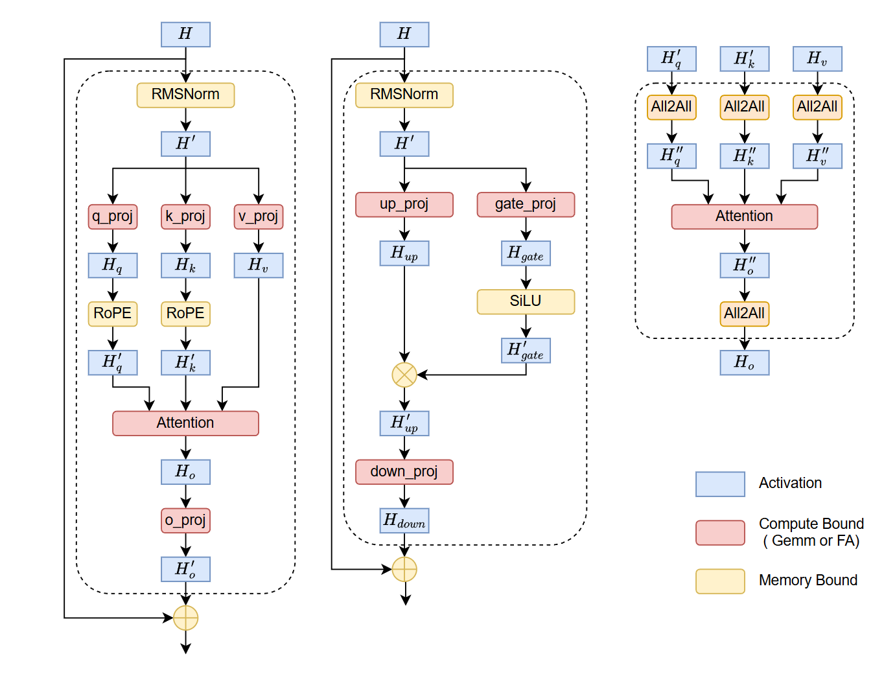
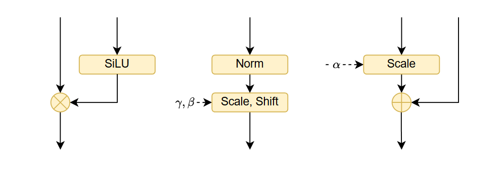

To optimize Large Language Models effectively, we must move beyond intuition and rely on first-principles modeling. This post provides a back-of-the-envelope **Roofline analysis** to pinpoint exactly where your training time goes—whether it's compute, memory, or communication—and how to architect your recompute and kernel-fusion strategies accordingly.

## Roofline Analysis: H200 Baseline & GEMM

### Hardware Baseline: H200

We assume the following specifications for the NVIDIA H200:
* Peak Memory Bandwidth (BW): 4.8 TB/s
* Peak Compute (BF16): $\approx$ 989 TFLOPS (Dense)
* NVLink Unidirectional BW: 450 GB/s

**Arithmetic Intensity ($I$)**: The ridge point (operational intensity required to maximize compute) is:

$$I_{ridge} = \frac{\text{Peak FLOPS}}{\text{Memory BW}} = \frac{989}{4.8} \approx 206 \text{ FLOPs/Byte}$$

### GEMM Analysis (Compute Bound)

For a standard projection GEMM with input $(s, h)$ and weight $(h, h)$:
* FLOPS: $2sh^2$
* Memory Access: $4sh + 2h^2$ (BF16 precision, 2 bytes per element)
* Operational Intensity:

$$I_{gemm} = \frac{2sh^2}{4sh + 2h^2} = \frac{sh}{2s+h}$$

For a typical hidden size $h=4096$:
* When $s=1$, $I = 1$. (Heavily Memory Bound)
* When $s=256$, $I = 228$. **Conclusion**: We need a sequence length of at least 256 tokens for LLM GEMMs to theoretically hit the compute-bound region on H200.

## Comparative Analysis: Bottlenecks

We normalize execution times against the standard GEMM operation to identify bottlenecks.

### Memory Bound Operators vs. GEMM

Operators like RMSNorm, RoPE, and Elementwise Add/Mul are strictly memory bound.
* RMSNorm Time: $\approx \frac{4sh}{BW}$
* GEMM Time: $\approx \frac{2sh^2}{\text{Peak FLOPS}}$
* Ratio:

$$\frac{T_{norm}}{T_{gemm}} = \frac{2 \cdot I_{ridge}}{h}$$

For $h=4096$ and $I_{ridge}=206$, this ratio is $\approx$ 10%. A single Norm takes roughly 10% of the time of a dense GEMM.

### All2All Communication vs. GEMM

We define the Communication-to-Memory Bandwidth Ratio ($R_{comm/mem}$):

$$R_{comm/mem} = \frac{\text{NVLink Unidirectional BW}}{\text{HBM BW}} = \frac{450}{4800} \approx \frac{1}{10.6}$$

This implies that for every 10.6 GB of local memory moved, we can transfer 1 GB over NVLink.

For an All2All operation (Context Parallelism):
* Traffic: $\frac{2sh \frac{cp-1}{cp}}{BW_{nvlink}} \approx \frac{2sh}{BW_{nvlink}}$ (Simplified for large CP)
* Ratio:
$$\frac{T_{all2all}}{T_{gemm}} \approx \frac{I_{ridge}}{R_{comm/mem} \cdot h} \approx \frac{2183.6}{h}$$

For $h=4096$, the ratio is $\approx$ 0.53. 
**Conclusion**: All2All communication takes approximately half the time of a GEMM computation.

### FlashAttention (FA) vs. GEMM

FA is a fused kernel with FLOPS $\approx 4s^2h$.

Ratio:

$$\frac{T_{FA}}{T_{gemm}} \approx \frac{4s^2h}{2sh^2} \cdot C = \frac{2s}{h}$$(Where $C$ is a constant adjusting for MFU differences).
**Conclusion**: As sequence length $s$ increases, FA dominates.

## Holistic View: The Llama Block

Analyzing a single Transformer block (Llama-style) reveals the distribution of time complexity. 

Assuming a relative time unit where Each GEMM Time = 1:
* Total GEMM Compute Volume: 12 units
    * Note: Llama employs SwiGLU with an expansion ratio of $\frac{8}{3}h$. The MLP block contains 3 kernels (Gate, Up, Down) but contributes $\approx 8$ units of compute. Combined with Attention (4 units), the total equivalent compute is $8+4=12$ standard $(h,h)$ GEMMs.
* FlashAttention: $\frac{2s}{h}$
* Memory Bound Ops (RMSNorm*2, RoPE*2, SiLU, Mul, Add*2): $\approx \frac{3914}{h}$
* Communication (4x All2All): $\approx \frac{8734}{h}$

Observation:
* For large $s$, FlashAttention becomes the primary bottleneck.
* The sum of all small memory-bound operators is roughly equivalent to 0.95x the cost of a single GEMM (assuming standard projections).
* The total communication cost (4 All2Alls) is roughly 2.1x the cost of a single GEMM.

### Activation Recomputation Strategy

Based on the Roofline analysis, we can derive a hierarchy for Gradient Checkpointing (Activation Recomputation). The goal is to recompute operations that are fast (low arithmetic intensity) or strictly memory bound, and save operations that are expensive.

Priority for Recomputation (Low Cost to High Cost):
1. Memory Bound Ops (Norms, RoPE, Elementwise):
    * Strategy: **Always Recompute**.
    * Reason: High speed, low FLOPs. Saving them consumes memory bandwidth twice (save + load grad), often costing more than recomputing.
2. All2All Communication:
    * Strategy: **Recompute (Selective)**.
    * Reason: Communication is slower than memory bound ops but faster than dense compute.
3. GEMM:
    * Strategy: **Avoid Recompute**.
    * Reason: High arithmetic intensity. Recomputing doubles the heaviest FLOPs load.
    * **The "Quantity" Problem**: unlike FlashAttention (1 per block), a Llama block contains 7 dense GEMMs (Q, K, V, O, Gate, Up, Down).
    * *Impact*: While a single GEMM output is manageable, the cumulative memory footprint of these 7 tensors dominates the training memory.
    * **Mitigation: Enable CPU Offloading with Prefetching.** Since GEMM compute time is substantial, it creates a latency window. We can asynchronously offload activations to CPU RAM and *prefetch* them back to GPU just before the backward pass of the specific layer, effectively hiding the PCIe latency.
4. FlashAttention:
    * Strategy: Never Recompute.
    * Reason: For long sequences, $O(N^2)$ complexity makes this the most expensive operation.

### Operator Fusion & Epilogue Optimization

To minimize HBM access and kernel launch overhead, operator fusion is mandatory. The golden rule is: Any sequence of contiguous memory-bound operators must be fused into a single kernel.

A. Vertical Fusion (Memory + Memory)
Complex normalization and positional embeddings (RMSNorm, LayerNorm, RoPE) are deceptive. In standard Eager execution, they decompose into long chains of tiny, bandwidth-bound kernels (e.g., Pow $\to$ Mean $\to$ Rsqrt $\to$ Mul $\to$ Cos/Sin).
* The Bottleneck: This triggers catastrophic kernel launch overheads and redundant HBM I/O for intermediate results.
* The Fix: Vertical fusion is non-negotiable. These chains must be compiled into single kernels (via Triton or custom CUDA) to keep intermediate states in SRAM/Registers.
* Specific Targets:
    * Norms & RoPE: Fuse all constituent arithmetic operations.
    * SwiGLU: Fuse SiLU and Elementwise Mul.
    * DiT AdaLN (Diffusion Transformers):
        * Norm + Modulate: Fuse LayerNorm with the affine scale/shift modulation.
        * Gate + Residual: Fuse the gating scalar multiplication with the subsequent elementwise addition.

B. Epilogue Fusion (Compute + Memory)
The boundary between Compute-bound (GEMM) and Memory-bound ops offers the highest ROI but is technically challenging.
* Mandatory Baseline (`torch.addmm`)
    * Mechanism: Exploits BLAS's $C = \beta C + \alpha (A \times B)$ to fuse either the Bias addition or the Residual accumulation into the GEMM kernel.
    * Critical Limitation: It represents an "Either-Or" choice. You cannot fuse both Bias ($b$) and Residual ($x$) simultaneously (i.e., $Y = x + (xA + b)$) using standard `addmm`, as the accumulator $C$ can only map to one tensor.
    * Impact: This forces a choice between fusing Bias (leaving Residual for a separate kernel) or fusing Residual (requiring Bias to be pre-fused), justifying the need for custom kernels.
* Advanced Epilogue
    * Target: Fuse the entire chain (GEMM+Bias+Act+Res) into the GEMM's register write-back phase.
    * Implementation: Use torch.compile (Inductor) as a first step. For critical paths, deploy custom CUTLASS or Triton kernels to eliminate all intermediate HBM access.