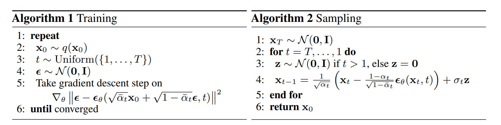

Generative modeling has evolved from probabilistic denoising to deterministic transport. This note explores the foundational shift from the stochastic curves of [Denoising Diffusion Probabilistic Model (DDPM)](https://arxiv.org/abs/2006.11239) to the straight-line trajectories of [Flow Matching (FM)](https://arxiv.org/abs/2210.02747), and how [Classifier-Free Guidance (CFG)](https://arxiv.org/pdf/2207.12598)—originally designed for diffusion—remains the universal steering mechanism for these modern vector fields.

## The Stochastic Path: DDPM

The Denoising Diffusion Probabilistic Model (DDPM) treats generation as **Reversing a Markov Chain**.

* **Forward Chain ($q$)**: We define a fixed chain that gradually destroys the clean image $x_0$ by adding Gaussian noise step-by-step until it becomes pure noise $x_T$.
* **Reverse Chain ($p_\theta$)**: The model's goal is to learn the reverse transitions—predicting the noise added at each step to "repair" the image from $x_T$ back to $x_0$.

**The Math: From Step-by-Step to One-Step**
The noise schedule is defined by $\beta_t$ (variance). To verify the state at any step $t$ without iterating, we define $\alpha_t = 1 - \beta_t$ and its cumulative product $\bar{\alpha}_t = \prod\_{s=1}^t \alpha_s$.
This allows us to sample $x_t$ directly from $x_0$:
$$x_t = \sqrt{\bar{\alpha}_t}x_0 + \sqrt{1-\bar{\alpha}_t}\epsilon$$

**The Noise Schedule (Pre-computation)**
Before training, we must define the noise schedule $\beta_t$. In the original DDPM, this is a linear schedule, meaning the variance of noise added increases linearly from $t=0$ to $t=T$.We pre-compute all constants ($\alpha_t, \bar{\alpha}_t$) to speed up training.

```python
import torch

def get_ddpm_constants(timesteps=1000):
    # 1. Define Beta Schedule (Linear)
    # As per Ho et al. 2020: from 1e-4 to 0.02
    beta_start = 0.0001
    beta_end = 0.02
    betas = torch.linspace(beta_start, beta_end, timesteps)

    # 2. Calculate Alphas
    alphas = 1.0 - betas
    
    # 3. Calculate Cumulative Product (Alpha Bar)
    # This is the key variable used for one-step sampling
    alphas_cumprod = torch.cumprod(alphas, dim=0)
    
    # 4. Pre-compute Sqrt Constants for the equation:
    # x_t = sqrt(alpha_bar) * x_0 + sqrt(1 - alpha_bar) * epsilon
    sqrt_alphas_cumprod = torch.sqrt(alphas_cumprod)
    sqrt_one_minus_alphas_cumprod = torch.sqrt(1.0 - alphas_cumprod)
    
    return sqrt_alphas_cumprod, sqrt_one_minus_alphas_cumprod

# Initialize once before training loop
sqrt_alphas_cumprod, sqrt_one_minus_alphas_cumprod = get_ddpm_constants()
```

**The Code: A Complete Training Step**
The following code demonstrates how we sample time, generate noise, apply CFG (Label Dropping), and compute the loss in a single training step.

```python
def extract(a, t, x_shape):
    """
    Extract coefficients at timesteps t and reshape to [Batch, 1, 1, 1]
    """
    batch_size = t.shape[0]
    out = a.gather(-1, t.cpu()) # Gather values at index t
    return out.reshape(batch_size, *((1,) * (len(x_shape) - 1))).to(t.device)

def train_step(model, x0, class_labels):
    """
    x0: Clean images [Batch, Channels, Height, Width]
    class_labels: Text embeddings or class IDs
    """
    batch_size = x0.shape[0]
    
    # 1. Sample Timestep (t)
    # Randomly pick a step for each image in the batch
    t = torch.randint(0, 1000, (batch_size,), device=x0.device)
    
    # 2. Generate Ground Truth Noise (epsilon)
    noise = torch.randn_like(x0)
    
    # 3. Add Noise (Forward Diffusion)
    # Note: 'sqrt_alphas_cumprod' comes from the get_ddpm_constants() function above
    sqrt_alpha_bar = extract(sqrt_alphas_cumprod, t, x0.shape)
    sqrt_one_minus_alpha_bar = extract(sqrt_one_minus_alphas_cumprod, t, x0.shape)
    # Reparameterization trick: x_t = µ + σ * ε
    x_t = sqrt_alpha_bar * x0 + sqrt_one_minus_alpha_bar * noise
    
    # 4. Label Dropping (for CFG)
    # Randomly replace labels with a 'null' token (e.g., with 10% probability)
    # This teaches the model both conditional and unconditional generation
    if random.random() < 0.1:
        class_labels = torch.full_like(class_labels, NULL_TOKEN)

    # 5. Model Prediction
    # The model tries to predict the noise we added
    noise_pred = model(x_t, t, class_labels)
    
    # 6. Calculate Loss
    # Simple MSE between the actual noise and predicted noise
    loss = F.mse_loss(noise_pred, noise)
    return loss
```



## The Straight Path: Flow Matching

DDPM relies on a curved, stochastic SDE path which requires many steps to sample.

Flow Matching evolves this by enforcing **a straight line trajectory** between noise ($x_0$) and data ($x_1$). This changes the paradigm from "denoising" to "deterministic transport."


We construct a linear interpolation path:

$$x_t = (1-t)x_0 + t x_1$$

The vector field required to move along this straight line is constant ($d x_t / dt = x_1 - x_0$).
Thus, the prediction target shifts from noise $\epsilon$ to velocity $v$.

**The Code: Velocity Prediction** 
Notice how much simpler the data construction becomes compared to DDPM constants.

```python
def flow_matching_loss(model, x1, class_labels):
    """
    x1: Real data [Batch, C, H, W]
    class_labels: Text embeddings or class IDs
    """
    x0 = torch.randn_like(x1)
    # Time is continuous [0, 1]
    t = torch.rand(x1.shape[0], device=x1.device).view(-1, 1, 1, 1)
    
    # 1. Linear Interpolation (Straight Path)
    x_t = (1 - t) * x0 + t * x1
    
    # 2. Target is Velocity (x1 - x0)
    target_v = x1 - x0
    
    # 3. Label Dropping (Crucial for CFG)
    # Just like in DDPM, we drop labels to enable guidance later
    if random.random() < 0.1:
        class_labels = torch.full_like(class_labels, NULL_TOKEN)
    
    # 4. Predict velocity
    # The model learns both conditional and unconditional vector fields
    pred_v = model(x_t, t, class_labels)
    
    return F.mse_loss(pred_v, target_v)
```

## Steering the Path: Classifier-Free Guidance (CFG)

Although CFG was originally proposed for DDPM, it acts as a universal steering mechanism for any Vector Field.

**Training: Multi-Task Learning via Label Dropping**
Before we can use CFG, we must prepare the model during training. 
As shown in the DDPM/FM code above, we apply Label Dropping (randomly replacing the text prompt with a "null" token, e.g., 10% probability).
This is effectively **Multi-Task Learning**. A single model is forced to learn two distinct distributions simultaneously:
* **Conditional** $p(x|c)$: "Generate an image that matches this text."
* **Unconditional** $p(x|\emptyset)$: "Generate a generic realistic image."

**Inference: Vector Arithmetic**
At inference time, we don't pick one task; we run both. We calculate the conditional velocity ($v_{cond}$) and the unconditional velocity ($v_{uncond}$), then extrapolate the difference to "sharpen" the result.
$$v_{final} = v_{uncond} + w \cdot (v_{cond} - v_{uncond})$$

**The Code: Inference Step**

```python
def cfg_step(model, x_t, t, prompt_emb, null_emb, w=4.0):
    """
    NOTE: This is the INFERENCE process.
    The model learned to handle both 'prompt_emb' and 'null_emb' 
    during training via Label Dropping.
    """
    
    # 1. Batch inputs for efficiency (Parallel execution)
    # We feed both the Prompt and the Null Token into the model at once
    x_in = torch.cat([x_t, x_t])
    t_in = torch.cat([t, t])
    c_in = torch.cat([prompt_emb, null_emb]) 
    
    # 2. Double batch prediction
    # The model predicts the velocity for both "tasks" simultaneously
    v_pred = model(x_in, t_in, c_in)
    v_cond, v_uncond = v_pred.chunk(2)
    
    # 3. Apply Guidance to Vector Field
    # We subtract the "generic" direction (uncond) and boost the "prompt" direction
    return v_uncond + w * (v_cond - v_uncond)
```