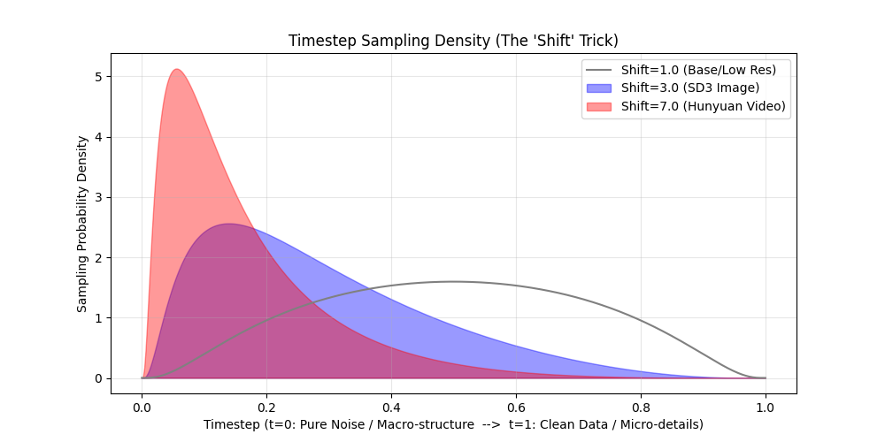

In Last Part [From DDPM to Flow Matching](/from-ddpm-to-flow-matching-the-evolution-of-generative-trajectories/), we covered the clean theory of Flow Matching. However, making a massive 13B-parameter HunyuanVideo converge isn't just about math; it requires rigorous engineering.

How do models like **Stable Diffusion 3 (SD3)**, **HunyuanVideo**, and **Wan** actually train? 
Here are the practical engineering tricks across the Time and Space dimensions.

## 1. The Time Dimension: Timestep Shift (Logit-Normal)

**Source:** 
*Stable Diffusion 3 (Esser et al., 2024)* & *HunyuanVideo (2024)*.

**The Physics of Time and Frequency:**
To understand why we must modify time, we must understand what the model learns at different timesteps. Assuming $t=0$ is Pure Noise and $t=1$ is Clean Video:
* Near $t=0$ (Noise-Heavy): The signal is extremely weak. The model cannot see textures; it is forced to construct the global silhouette, color blobs, and macro-motion. It learns Low-Frequency structures.
* Near $t=1$ (Data-Heavy): The structure is already formed. The model acts as a sharpening filter, removing tiny Gaussian grains to restore sharp edges and pores. It learns High-Frequency details.

**The Problem: The Resolution-Noise Mismatch**
Standard DiTs sample $t$ uniformly ($t \sim U[0, 1]$). While this works for generating $256 \times 256$ resolution, it breaks down completely at higher resolutions (like $1080p$) due to pixel redundancy and spatial averaging.

In Flow Matching (and Diffusion), zero-mean independent Gaussian noise is added to each pixel. Consider a semantic feature, like a dog's eye:
* **At low resolution** ($256 \times 256$): The eye might occupy a single latent pixel. Adding a moderate noise level $t$ completely overwrites this pixel. The macro-structure is destroyed, and the model is forced to reconstruct it from scratch.
* **At high resolution** ($1080p$): The exact same eye now occupies a $4 \times 4$ patch (16 pixels). The color signal is highly redundant. Because the noise is independent, whenever the DiT's attention mechanism implicitly aggregates this local region, the noise cancels out (its standard deviation shrinks by $1/\sqrt{16}$).

Consequently, the effective Signal-to-Noise Ratio (SNR) at the macroscopic level is significantly higher at large resolutions. The model can simply "look through" the noise by implicitly averaging neighboring pixels. The global structure is never truly destroyed; only the high-frequency pixel-level textures are corrupted.

If we sample $t$ uniformly, the 13B parameter model rarely encounters a state where the global structure is missing. It wastes its compute acting as a localized "texture sharpener," rather than learning global physics and consistent motion trajectories.

**The Trick: Shifted Logit-Normal Distribution**
To prevent the model from exploiting this spatial redundancy, we must explicitly inject much stronger noise at high resolutions to genuinely destroy the macro-structure. Because stronger noise corresponds to $t \approx 0$ (Pure Noise), the "sweet spot" of timesteps that actually obscure the global structure becomes vanishingly small at 1080p.

If we continue to sample $t$ uniformly, the model will spend 90% of its training iterations on timesteps where the structure is already visible, wasting its 13B parameters on localized texture sharpening.

To fix this, SD3 and HunyuanVideo abandon uniform sampling. Instead, they sample $t$ from a Shifted Logit-Normal distribution. By adjusting a shift parameter that scales with the video resolution, they mathematically push the sampling probability heavily towards the pure-noise end ($t \approx 0$). This ensures the network spends the vast majority of its compute learning macro-structures and temporal dynamics, rather than micro-textures.

**Visualization & Code**
Here is the Python script demonstrating how SD3 and Hunyuan mathematically shift their training focus away from the easy $t \approx 1$ regions. As the shift parameter increases for higher resolutions, the sampling probability stacks heavily on the left side ($t \approx 0$).



```python
import numpy as np
import matplotlib.pyplot as plt
from scipy.stats import norm

def shifted_logit_normal(t, shift=1.0):
    """
    Simulates the probability density of sampling timestep t.
    Convention: t=0 (Pure Noise), t=1 (Clean Data).
    """
    # Avoid div-by-zero at boundaries
    t = np.clip(t, 1e-5, 1 - 1e-5)
    
    # 1. Standard Logit Transform
    logit_t = np.log(t / (1 - t))
    
    # 2. Shift the distribution
    # A shift > 1 pushes density towards t=0 (Noise / Macro-structure)
    shifted_logit_t = logit_t + np.log(shift)
    
    # 3. Calculate Density (Jacobian included for the logit transform)
    pdf = norm.pdf(shifted_logit_t) / (t * (1 - t))
    return pdf

# Plotting the density
t = np.linspace(0, 1, 500)
plt.figure(figsize=(10, 5))

# Shift = 1.0 (Standard bell curve, centered)
plt.plot(t, shifted_logit_normal(t, shift=1.0), label="Shift=1.0 (Base/Low Res)", color='gray')

# Shift = 3.0 (SD3 High Res - Pushed towards noise)
plt.fill_between(t, shifted_logit_normal(t, shift=3.0), alpha=0.4, color='blue', label="Shift=3.0 (SD3 Image)")

# Shift = 7.0 (HunyuanVideo - Aggressively pushed towards noise)
plt.fill_between(t, shifted_logit_normal(t, shift=7.0), alpha=0.4, color='red', label="Shift=7.0 (Hunyuan Video)")

plt.title("Timestep Sampling Density (The 'Shift' Trick)")
plt.xlabel("Timestep (t=0: Pure Noise / Macro-structure  -->  t=1: Clean Data / Micro-details)")
plt.ylabel("Sampling Probability Density")
plt.legend()
plt.grid(True, alpha=0.3)
plt.savefig("timestep_sampling_density.png")
```


## 2. The Space Dimension: 3D RoPE

**Source**: HunyuanVideo & Wan2.1.

**The Problem: The 3D Nature of Video**
Unlike text, which is a strictly 1D sequence, video data inherently possesses three dimensions: Time, Height, and Width. Standard 1D RoPE, originally designed for LLMs, can only encode a single sequence index. It cannot simultaneously represent a token's spatial and temporal coordinates within the 3D volume.

**The Trick: Pre-concatenated 3D RoPE Frequencies**
To inject full 3D positional awareness, the model factorizes the 3D space. The attention head dimension (e.g., 128 in HunyuanVideo) is logically partitioned to represent the three dimensions ($d_t=16$, $d_h=56$, $d_w=56$).

A brute-force implementation might write a custom CUDA kernel to explicitly apply different rotary frequencies to their respective channel slices on the fly. However, this fragments memory access patterns, significantly degrading memory bandwidth utilization compared to contiguous 1D operations.

The elegant engineering solution is to shift the complexity to the initialization phase and perform a mathematical tensor permutation. Standard 1D RoPE kernels expect the feature dimension to be split into two contiguous halves: $[Half_1, Half_2]$. If we naively concatenate the 1D RoPE outputs for Time (F), Height (H), and Width (W), the memory layout becomes interleaved:

$$[\frac{D_F}{2}, \frac{D_F}{2}, \frac{D_H}{2}, \frac{D_H}{2}, \frac{D_W}{2}, \frac{D_W}{2}]$$

To fix this, we reorder the tensor by grouping all the "first halves" together and all the "second halves" together:

$$[\frac{D_F}{2}, \frac{D_H}{2}, \frac{D_W}{2}, \frac{D_F}{2}, \frac{D_H}{2}, \frac{D_W}{2}]$$

Because the cos and sin embeddings are pre-packed into this exact layout offline, the actual application (apply_rotary_pos_emb) inside the Transformer block remains 100% identical to a standard LLM. This allows the model to directly leverage off-the-shelf, highly optimized LLM infrastructure (like FlashAttention's fused RoPE kernels) with perfectly coalesced memory accesses.

**The Code: Frequency Precomputation**
Here is the core logic mirroring [HunyuanVideo's implementation](https://github.com/Tencent-Hunyuan/HunyuanVideo/blob/main/hyvideo/modules/posemb_layers.py#L191C1-L258C19), showing the exact channel splitting and reordering.

```python
import torch

def precompute_3d_rotary_freqs(t_grid, h_grid, w_grid, head_dim=128, theta=10000.0):
    # 1. Partition the feature channels (HunyuanVideo split: 16, 56, 56)
    d_t, d_h, d_w = 16, 56, 56
    
    # 2. Compute standard 1D RoPE frequencies for each axis
    # Returns a list of [cos, sin] tuples for each dimension
    emb_t = get_1d_freqs(d_t, t_grid, theta)
    emb_h = get_1d_freqs(d_h, h_grid, theta)
    emb_w = get_1d_freqs(d_w, w_grid, theta)
    
    # 3. The Tensor Permutation Trick
    # Group all first halves (cos) and second halves (sin) to match standard 1D kernel expectations
    cos_3d = torch.cat([emb_t[0], emb_h[0], emb_w[0]], dim=-1) # [D_F/2, D_H/2, D_W/2]
    sin_3d = torch.cat([emb_t[1], emb_h[1], emb_w[1]], dim=-1) # [D_F/2, D_H/2, D_W/2]
    
    return cos_3d, sin_3d

# Inside the Attention Forward Pass:
# Q and K are processed by standard 1D RoPE kernels using the mathematically reordered cos/sin.
# q_rotated, k_rotated = apply_rotary_pos_emb(q, k, cos_3d, sin_3d)
```

---
Other tricks, Coming soon...