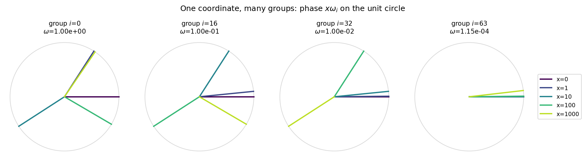
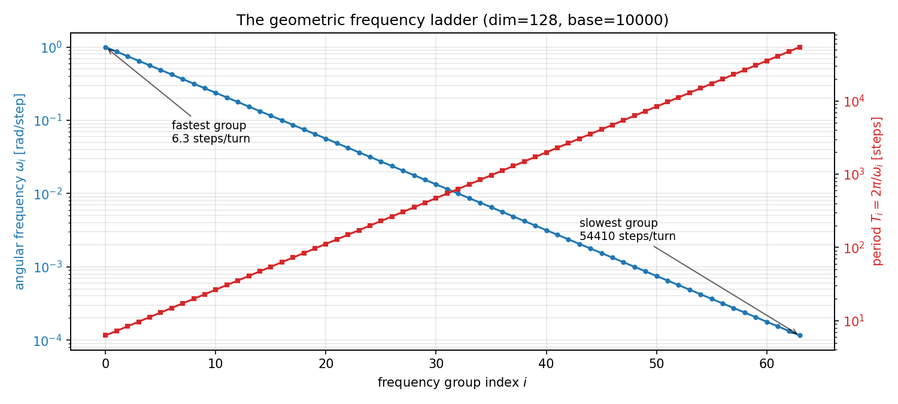
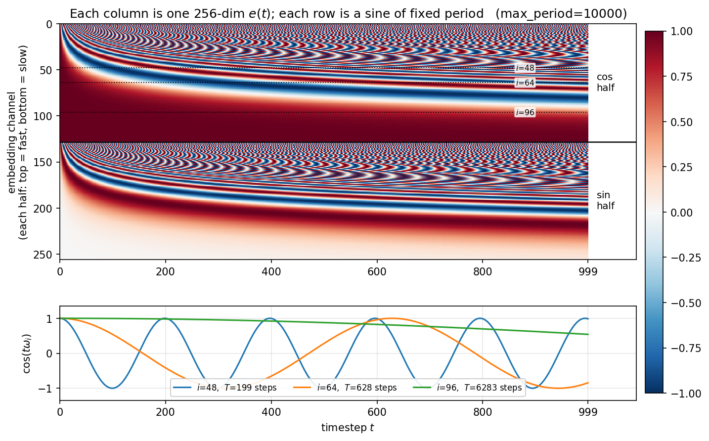
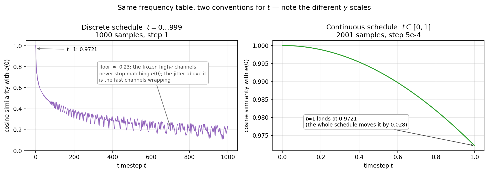
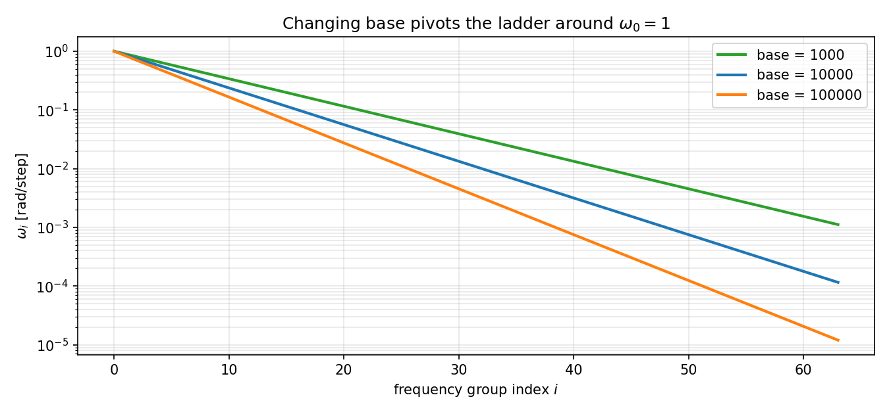

RoPE belongs to the Transformer world and timestep embedding belongs to the Diffusion world, yet a DiT block uses both — and if you open the two implementations side by side, you will find the *same* frequency table. Both are the same three-step pipeline:

$$x \longmapsto \theta_i = x\omega_i \longmapsto \big(\cos\theta_i,\ \sin\theta_i\big), \qquad i = 0, 1, \ldots, m-1$$

* $x$ is a **scalar coordinate**: a token position $p$ for RoPE, a diffusion time $t$ for timestep embedding.
* $\omega_i$ is the **angular frequency** of the $i$-th two-dimensional group, and there are $m$ of them.
* $\theta_i$ is that group's **phase** at the current coordinate.

The single scalar $x$ feeds *all* $m$ groups at once — Section 2 explains why.

The real difference is not in the frequencies. It is in what happens to the sine and cosine at the end:

* **RoPE** uses the phase to *rotate* the existing query and key.
* **Timestep embedding** uses the sine and cosine *directly* as a conditioning feature.

## 1. Angular Frequency, Phase, and Period

A point on the unit circle is $(\cos\theta, \sin\theta)$, where $\theta$ is the **phase** — how far around the circle we have turned. Phase is measured in **radians**, one full turn being $2\pi$ of them:

$$2\pi\ \text{rad} = 360^\circ \quad\Longrightarrow\quad 1\ \text{rad} = \frac{180^\circ}{\pi} \approx 57.2958^\circ$$

`torch.cos` and `torch.sin` take radians, not degrees; every number below is in radians unless marked $^\circ$.

Four quantities describe the same rotation, and mixing them up is the most common confusion here:

| quantity | symbol | unit | reads as | conversions |
| --- | :---: | --- | --- | --- |
| phase | $\theta$ | rad | how far around we are *right now* | $\theta = x\omega$ |
| frequency | $f$ | turns / step | how many **full turns** per unit of $x$ | $f = 1/T = \omega/2\pi$ |
| angular frequency | $\omega$ | rad / step | how many **radians** per unit of $x$ | $\omega = 2\pi f = 2\pi/T$ |
| period | $T$ | steps | how far $x$ must advance for **one full turn** | $T = 1/f = 2\pi/\omega$ |

The trap is the middle two rows: $\omega = 1$ does **not** mean "one turn per step", it means one *radian* per step. Following that value across:

$$\omega = 1\ \tfrac{\text{rad}}{\text{step}} \quad\Longrightarrow\quad f = \frac{1}{2\pi} \approx 0.159\ \tfrac{\text{turns}}{\text{step}} \quad\Longrightarrow\quad T = 2\pi \approx 6.283\ \text{steps}$$

$\omega = 1$ is not an arbitrary example. The classic ladder is $\omega_i = B^{-i/m}$ (Section 3), so group 0 always lands on $\omega_0 = B^0 = 1$ — **regardless of `base`, `max_period`, or the dimension**:

> The fastest group of every classic RoPE and timestep embedding advances exactly $57.2958^\circ$ per step and needs $2\pi \approx 6.283$ steps per revolution. No hyperparameter changes this — `base` *pivots* the ladder around this fixed point rather than shifting it (Section 6); only rescaling the coordinate, $x \to sx$, moves it.

## 2. Why More Than One Frequency?

A single frequency gives an encoding that repeats exactly:

$$e(p) = \Big(\cos(p\omega),\ \sin(p\omega)\Big) \quad\Longrightarrow\quad e(p) = e\left(p + \tfrac{2\pi}{\omega}\right)$$

One frequency alone cannot resolve neighbouring positions *and* stay unambiguous over long ranges, so both constructions use a whole bank of them, ordered **descending** — the opposite of what the indexing suggests:

$$\omega_0 > \omega_1 > \cdots > \omega_{m-1}$$

Group 0 is the **fastest**, group $m-1$ the slowest. Low-index groups resolve adjacent positions but wrap constantly, so they cannot say *which* revolution you are on; high-index groups are nearly flat between neighbours but never wrap over the range of interest, so they fix the coarse location. Neither works alone — the *combination* is what forms a multi-scale code.


Fig. 1: The same coordinate $x$ seen by four groups (dim=128, base=10000), fastest on the left. Group 0 has already aliased badly by $x=10$ — its $x=1$ and $x=1000$ arrows land 0.03 rad apart purely by coincidence. Group 63, the slowest, has barely left the origin even at $x=1000$.

## 3. The Classic Frequency Ladder

Classic RoPE and most timestep embeddings use the same geometric ladder:

$$\omega_i = B^{-2i/d} = B^{-i/m}, \qquad m = \frac{d}{2}, \qquad i = 0, 1, \ldots, m-1$$

where $d$ is the encoding dimension (or the rotary dimension), each *pair* of channels forms one 2D group, and $B$ is typically $10000$. The two exponent forms are identical because $\frac{2i}{d} = \frac{i}{d/2}$. The periods are $T_i = 2\pi B^{i/m}$.

The **minus sign in the exponent** is what makes this a descending ladder: with $B > 1$, growing $i$ drives $B^{-i/m}$ down, so $\omega_i$ shrinks and $T_i$ grows. Group 0 sits at the top with $\omega_0 = B^0 = 1$, the largest angular frequency and the shortest period — and as noted in Section 1, that top rung is fixed at $1$ for **any** $B$ and any $d$. Only the rungs below it move.

For the canonical `dim = 128, base = 10000` we get $m = 64$ groups with $\omega_i = 10000^{-i/64}$, and consecutive frequencies have a **fixed ratio**

$$\frac{\omega_{i+1}}{\omega_i} = 10000^{-1/64} \approx 0.865964 < 1$$

so each step down the ladder loses about 13% of the previous frequency — a geometric sequence, evenly spaced in *log* frequency, not a linear ramp.

| group $i$ | $\omega_i$ (rad/step) | degrees per step | period $T_i$ |
| ---: | ---: | ---: | ---: |
| 0  | 1.000000 | 57.2958° | 6.283 |
| 8  | 0.316228 | 18.1185° | 19.869 |
| 16 | 0.100000 | 5.7296°  | 62.832 |
| 24 | 0.031623 | 1.8119°  | 198.692 |
| 32 | 0.010000 | 0.5730°  | 628.319 |
| 40 | 0.003162 | 0.1812°  | 1986.918 |
| 48 | 0.001000 | 0.0573°  | 6283.185 |
| 63 | 0.000115478 | 0.006616° | 54410.143 |


Fig. 2: As $i$ grows, $\omega_i$ **falls** (blue) from $1$ to $1.15\times10^{-4}$ rad/step while the period $T_i$ **rises** (red) from ~6 steps to ~54k. Low index = fast = short period. A straight line on a log axis is exactly what "geometric sequence" means.

A frequent misreading:

> Each position does **not** get its own angular frequency. *All* positions share the same 64 frequencies. What the position changes is the **phase**, $\theta_i(p) = p\omega_i$.

## 4. RoPE: Position → Phase → Rotation

RoPE does not produce a position vector to add onto the token embedding. It **rotates** query and key. Split the rotary dimensions into 2D groups $(x_0,x_1), (x_2,x_3), \ldots$, give group $i$ the frequency $\omega_i$, and rotate by $\theta_i(p) = p\omega_i$:

$$\begin{bmatrix} x^{\prime}\_{2i} \\\\ x^{\prime}\_{2i+1} \end{bmatrix} = R(p\omega_i) \begin{bmatrix} x_{2i} \\\\ x_{2i+1} \end{bmatrix}, \qquad R(\theta) = \begin{bmatrix} \cos\theta & -\sin\theta \\\\ \sin\theta & \cos\theta \end{bmatrix}$$

**Why this expresses relative position.** Put query vector $\mathbf{q}_i$ at position $p$ and key vector $\mathbf{k}_i$ at position $n$. Their per-group dot product is

$$\big(R(p\omega_i)\mathbf{q}_i\big)^{\top} \big(R(n\omega_i)\mathbf{k}_i\big) = \mathbf{q}_i^{\top} R(p\omega_i)^{\top} R(n\omega_i) \mathbf{k}_i = \mathbf{q}_i^{\top} R\big((n-p)\omega_i\big) \mathbf{k}_i$$

using $R(a)^{\top}R(b) = R(b-a)$. The absolute positions cancel and only $n - p$ survives:

> **Absolute position determines the rotation; only relative position survives in the attention score.**

Pairs at equal distance — $(0,1)$, $(10,11)$, $(100,101)$ — get identical relative rotation in every group. But the *absolute* encoding never exactly repeats. A single group would need $\Delta p = kT_i$, and group 0 has $\omega_0 = 1$, requiring $\Delta p = 2\pi k$, never an integer. Requiring all 64 groups to wrap simultaneously is stricter still.

**What actually changes from position 0 to position 1?** At $p = 0$ every phase is zero, so every $R(0) = I$ — position 0 is the un-rotated token. At $p = 1$ the phase of group $i$ is exactly $\omega_i$, so the step $0 \to 1$ is not "one rotation": group 0 turns $57.2958°$, group 16 turns $5.7296°$, group 32 turns $0.5730°$, group 63 turns $0.006616°$.

> Moving one position rotates 64 different 2D planes by 64 different angles.

For an arbitrary gap, $\Delta\theta_i = \Delta p \cdot \omega_i$. Group 32 across a 100-token gap gives $1$ rad $\approx 57.3°$ — the same rotation group 0 gets from a *single* step. That spread is the multi-scale property in one number.

## 5. Timestep Embedding: Time → Phase → Feature Vector

The standard implementation:

```python
def get_timestep_embedding(
    timesteps: Tensor, embedding_dim: int, max_period: float = 10000.0
) -> Tensor:
    """Sinusoidal timestep embedding in ``[cos, sin]`` order, in float32.

    Equivalent to diffusers ``get_timestep_embedding`` with
    ``flip_sin_to_cos=True`` and ``downscale_freq_shift=0`` — the combination
    every modern DiT uses, though not the library's defaults.
    """
    half_dim = embedding_dim // 2

    # exponent_i = -log(B) * i   ->   omega_i = exp(-log(B) * i / m) = B^(-i/m)
    exponent = -math.log(max_period) * torch.arange(
        half_dim, dtype=torch.float32, device=timesteps.device
    )
    phase = timesteps[:, None].float() * torch.exp(exponent / half_dim)[None, :]

    return torch.cat([torch.cos(phase), torch.sin(phase)], dim=-1)
```

The frequency line is exactly $\omega_i = B^{-i/m}$ — the same ladder as Section 3. Timestep embeddings are normally 256-dim (HunyuanVideo, Qwen-Image, Sana, AuraFlow all hard-code it), giving $m = 128$ groups against RoPE's 64 on a 128-dim head. Same range, sampled twice as densely: the even groups of the 256-dim table are *bit-for-bit* the 64 frequencies of classic RoPE, since $\omega_{2i}^{(256)} = B^{-2i/128} = B^{-i/64} = \omega_i^{(128)}$. What differs is the last line — instead of rotating anything, the phases are emitted directly.

$$\boxed{\ \text{RoPE: position} \to \text{phases} \to \text{rotate existing Q/K}\ }$$
$$\boxed{\ \text{Timestep: time} \to \text{phases} \to \text{emit a conditioning vector}\ }$$


Fig. 3: **Top** — every column is one 256-dim $e(t)$; rows $0$–$127$ are the cosines and $128$–$255$ the sines, so reading either half downwards walks the ladder from fast to slow. Note what is fixed and what varies: each *row* is a sine of one **fixed** period, and moving right along it only advances that row's phase — going *down* is what changes the period, from 6.3 steps at the top to 58470 at the bottom. The woven texture is a beat between neighbouring rows whose periods differ by 7.5%, not structure inside any single channel, and the solid red and white bands closing each half are the slow rows, still frozen at $\cos 0 = 1$ and $\sin 0 = 0$ after 0.107 rad of total travel. **Bottom** — the three dotted rows drawn as waveforms: even at $i = 48$ only five periods fit in the entire schedule, and by $i = 96$ barely a sixth of one.


Fig. 4: Cosine similarity with $e(0)$ — same frequency table, two conventions for $t$. Left: the discrete schedule falls to a floor near $0.22$, held up by the frozen high-$i$ channels. Right: $t \in [0,1]$ moves the embedding by only $0.030$ in total (note the $y$ range), because the fastest group gains $1$ rad instead of $999$. Same table, 1000× less phase.

**Timestep 0 vs timestep 1.** At $t = 0$ all phases vanish, so $e(0) = [1,\ldots,1,\ 0,\ldots,0]$. At $t=1$ group $i$ sits at phase $\omega_i$ — the same increment as RoPE's $p{=}0 \to p{=}1$. Write $v_i(t) = \big(\cos(t\omega_i),\ \sin(t\omega_i)\big)$ for the 2D vector group $i$ contributes, i.e. its point on the circle in Fig. 1. Starting from $v_i(0) = (1,0)$, it travels

$$\lVert v_i(1) - v_i(0) \rVert = \sqrt{(\cos\omega_i - 1)^2 + \sin^2\omega_i} = 2\left|\sin\frac{\omega_i}{2}\right| \approx \omega_i \quad (\omega_i \ll 1)$$

so movement falls with $i$: group 0 swings $0.9589$, group 64 moves $0.0100$, group 127 only $0.000107$.

Two properties of the assembled vector follow. **The norm is constant**: each group contributes $\cos^2 + \sin^2 = 1$, so $\lVert e(t) \rVert = \sqrt{128} \approx 11.31$ for every $t$. All embeddings live on one sphere and $t$ merely slides the point across it, so the information is entirely in the *direction* — hence cosine similarity is the right comparison, and the downstream MLP sees a stable input scale at every $t$.

**Adjacent timesteps are nearly identical**: $\lVert e(1) - e(0) \rVert \approx 2.6712$ and $\cos\text{-sim} \approx 0.9721$ state the same fact, since a fixed norm makes each determine the other. For scale, the furthest any timestep gets from $e(0)$ is $15.10$ (at $t = 970$) — one step covers just 18% of the schedule's full span. A few fast channels move a lot, most barely move, and the result is the smooth conditioning signal you want.

## 6. What `base` / `max_period` Really Control

RoPE calls it `base`, timestep embedding calls it `max_period`. Same role: $\omega_i = B^{-i/m}$, so $T_i = 2\pi B^{i/m}$.


Fig. 5: Changing base does not shift the ladder — it **pivots** it. Group 0 is pinned at $\omega_0 = B^0 = 1$ regardless of $B$; the effect grows monotonically with $i$ and is largest at the high-index (slowest) end.

Raising $B$ lowers every $\omega_i$ with $i > 0$: longer periods, less phase per unit distance. Lowering it does the reverse, buying local resolution at the cost of the slow features that carry long-range trend.

This is a different knob from `embedding_dim`, and the log axis of Fig. 2 makes the difference sharp — the ladder is a straight line there:

> **`base` rotates that line about its pinned left end $\omega_0 = 1$; `embedding_dim` only sets how many points are marked along it.**

Doubling the width leaves the line exactly where it was, which is why the 256-dim table merely interleaves one new frequency between each neighbouring pair of the 128-dim one.

| Base | $\omega_{32}$ | $T_{32}$ | $\omega_{63}$ | $T_{63}$ |
| ---: | ---: | ---: | ---: | ---: |
| 1000   | 0.031623 | 198.69  | 1.114e-3 | ~5,640 |
| 10000  | 0.010000 | 628.32  | 1.155e-4 | ~54,410 |
| 100000 | 0.003162 | 1986.92 | 1.198e-5 | ~524,874 |

Three consequences that trip people up:

**`max_period = 10000` is not a period of 10000.** The name comes from confusing $\omega$ with $f$ — the trap from Section 1. Under DDPM's $s=1$ the last index gives $\omega_{m-1} = B^{-1}$ exactly, so $1/\omega_{m-1} = B$. But $1/\omega$ is not a period — the period is $2\pi/\omega$, putting the real maximum at $2\pi B \approx 62832$. With modern $s=0$ it does not even reach $1/B$, since the last index is $m-1$. So the parameter sets the *order of magnitude of the lowest angular frequency*, not any literal period:

| | $\omega_{m-1}$ | $1/\omega_{m-1}$ | true period $2\pi/\omega_{m-1}$ |
| --- | ---: | ---: | ---: |
| $s = 1$ (DDPM) | $1.000\times10^{-4}$ | **10000** | 62832 |
| $s = 0$ (modern DiT) | $1.155\times10^{-4}$ | 8660 | 54410 |

**A longer period is not free context length.** Raising base makes the mid- and high-index groups see a given distance as "closer" — group 32 at $\Delta p = 100$ rotates $3.16$ rad at base 1000, $1.00$ rad at base 10000, $0.32$ rad at base 100000. That is why base scaling shows up in long-context recipes. But a model has already fit one particular rotation geometry during training; changing $B$ at inference changes the phase at every position and the relative rotation in every attention score. Longer periods are *necessary*, not *sufficient* — the real recipes pair it with continued pre-training or a long-context adaptation stage.

**`max_period` is not the number of diffusion steps.** $t \in \{0,\ldots,999\}$ does not imply `max_period = 1000`. With `dim=128, max_period=10000`, group 63 gains $0.115$ rad across the entire schedule while group 0 gains $999$ rad — about 159 turns. Too large and the slow channels go dead (quantified below); too small and everything wraps, leaving no stable slow feature. Bigger is not better.

## Engineering Notes

Implementation details that do not change the geometry above:

* **Channel layout.** Group $i$ may occupy channels $(i,\ m{+}i)$ (*split-half*) or the adjacent pair $(2i,\ 2i{+}1)$ (*interleaved*, which is what `diffusers` uses). Both work, but a checkpoint trained under one is scrambled by the other — this is why converting LLaMA weights to HF requires permuting `q_proj` and `k_proj`.
* **Rescaling the coordinate ≠ changing the base.** Rescaling $x \to sx$ multiplies *every* frequency by the same $s$ (a uniform stretch — this is what position interpolation does). Changing $B \to B^{\prime}$ scales group $i$ by $(B^{\prime}/B)^{-i/m}$, which depends on $i$: the fast group 0 is untouched, the slow high-index tail shifts most. Non-uniform.
* **Nothing requires integers.** $\theta_i(x) = x\omega_i$ is defined for any real $x$, which is why video DiTs can use fractional or normalized position grids, and why diffusion works with continuous $t$, $\sigma$, or $\log\sigma$. Two caveats: some kernels index a precomputed cos/sin cache by integer id and *do* require integers; and switching a schedule from $t \in [0,999]$ to $t \in [0,1]$ without touching the frequencies compresses every phase ~1000×, which is an easy bug to hit when porting between discrete and continuous-time formulations.
* **`embedding_dim`.** Extra width samples the same frequency range more densely; it does not extend it. Over $t \in [0,999]$ the slowest quarter of groups never reach 1 rad, so $\sin(t\omega_i) \approx t\omega_i$ and they become rescaled copies of $t$ — at dim 256 those 64 channels carry about **2** effective dimensions. By 99%-energy SVD rank: dim 128 → 57, 256 → 93, 512 → 147. The conventional 256 is not a necessity. What must match the schedule is `max_period`: feed $t \in [0,1]$ to the same table unscaled and the whole embedding collapses to **rank 1**, which is why AuraFlow and Qwen-Image pass `scale=1000`.
* **`rotary_dim`** — RoPE need not rotate the whole head. `head_dim=128, rotary_dim=64` rotates 64 channels (32 groups) and passes the rest through, preserving purely content-based features.
* **`downscale_freq_shift` and `flip_sin_to_cos` — DDPM leftovers.** DDPM used $s = 1$ in $\exp\big(-\log B \cdot \frac{i}{m-s}\big)$ and emitted $[\sin, \cos]$. `diffusers` keeps both as signature defaults, but modern DiTs override them — 0.36 has 43 call sites at $s=0$ versus 2 at $s=1$, and HunyuanVideo, Qwen-Image, Sana and AuraFlow all pass `flip_sin_to_cos=True, downscale_freq_shift=0`. The trap is calling `get_timestep_embedding` directly and inheriting $s=1$, which drops the slowest frequencies by 13%. `flip_sin_to_cos` is pure ordering, but must match the weights.

## Summary

Both constructions start from a scalar coordinate, assign each 2D group a different angular frequency, compute a phase, and take sine and cosine. Only the final step differs.

| | RoPE | Timestep embedding |
| --- | --- | --- |
| Input | token position $p$ | timestep / noise level $t$ |
| Frequencies | $\omega_i = B^{-i/m}$ | $\omega_i = B^{-i/m}$ (identical) |
| Phase | $p\omega_i$ | $t\omega_i$ |
| Use of sin/cos | rotate Q and K | emitted directly as a conditioning vector |
| What it expresses | relative position | current time / noise state |
| $0 \to 1$ phase delta | $\omega_i$ | $\omega_i$ |
| Hyperparameter name | `base` | `max_period` |

$$\boxed{\ \omega_i \text{ is an angular frequency: radians gained per unit coordinate by group } i\ }$$

The current angle is $x\omega_i$, the period is $T_i = 2\pi/\omega_i$. Under the canonical `dim=128, base=10000`: 64 groups in geometric progression (ratio $\approx 0.866$), from $\omega_0 = 1$ down to $\omega_{63} \approx 1.15\times10^{-4}$ rad/step, periods spanning $6.283 \to 54410$. Equal position gaps give equal *relative* RoPE, the full encoding never exactly repeats, and raising `base` mainly lowers the already-slow tail — buying a longer positional scale, but not automatically better long-context behaviour.

The plotting and verification code for every figure and number above lives in [`demo.py`](./demo.py).
